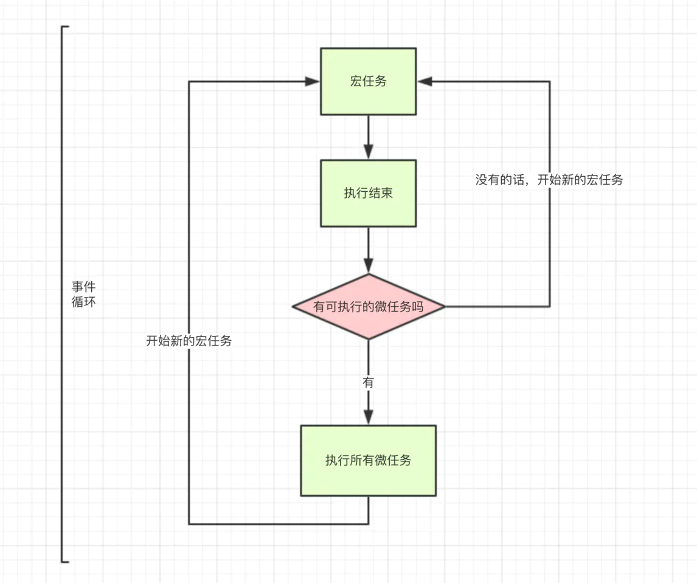

## javascript 总结

框架参考：
//https://juejin.im/post/6844904116339261447
1. 数据类型、转换、隐式转换、判断       
2. 执行上下文--作用域、作用域链、变量对象、this、闭包   
3. 原型、对象的创建和继承               

事件循环--eventloop （小知识点）

javascript垃圾回收、v8引擎垃圾回收 （小知识点）

异步流程：{
    promise、settimeout、settimeinterval、generator、await/async
}

手写代码：{
    深浅拷贝，
    promise、await、async
    call、bind、apply
    new
    柯里化
    sleep
    ajax
    冴羽大佬专题
}

es6 增强语法：{
let/const/var、模板字符串、箭头函数、set、map、Iterator/for of、class、模块化
}

api总结：{
    数组、字符串、object、bom、dom、其他重要方法
}（不急）

正则    --阮一峰es5、es6,放在参考里面就好了。


### 1.数据类型、转换、隐式转换、判断

#### 数据类型

一共8种数据类型:Undefined、Null、Boolean、Number、String、Object、Symbol、BigInt

基本数据类型：Undefined、Null、Boolean、Number、String、Symbol、BigInt

引用数据类型：Object

##### Undefined
一个变量声明后没有初始化，值就是 undefined。没有声明就是用变量会报错，但是使用 typeof 判断时还是 undefined。

```
var msg
alert(msg)  //undefined
alert(a)    //报错
alert(typeof msg)   //undefined
alert(typeof a)   //undefined
```

##### Null
一个空对象指针，表示这个地方没有值。null 值的主要作用是如果定义的变量在将来用于保存对象，那么最好将该变量初始化为null，可以方便的知道是否已经保存了对象。

> 注意：使用typeof null 值为 “Object” ，是js存在的一个bug

> null 和 undefined
> 
> 实际上，undefined是派生自null值的，所以 alert(null == undefined)  为 true。
> 但是它们用途不同，没有必要将一个变量显式初始化为undefined，但是对保存对象的变量而言，有必要初始化为null

##### Boolean
只有 false 和 true（只有小写），可以使用Boolean()将其他数据类型转换为boolean值。

调用Boolean()转换规则：（“有东西”就为true）
|数据类型|结果|
|----|----|
|Number|除了0 和 NaN 都为true|
|String|除了""(空字符串)都为true|
|Object|true|
|undefined 和 null|false|

##### Number
Number 可以表示整数、浮点数、科学计数法和各种进制。JavaScript能够表示的最小数值保存在 Number.MIN_VALUE 中——在大多数浏览器中，这个值是 5e-324；能够表示的最大数值保存在 Number.MAX_VALUE 中——在大多数浏览器中，这个值是 1.7976931348623157e+308。如果超出数值范围，则会自动转化成有正负的Infinity值，且无法参加下一次的计算，可以用isFinite()函数来判断是否处于有效范围内。


```
var intNum=6
var floatNum1=1.1
var floatNum2=.1    //有效、但是不推荐
var floatNum3=3.125e7   //31250000
//八进制的第一位必须为0，后面是0~7，如果超出范围，则按照十进制解析
var octalNum1=070    //八进制的56
var octalNum2=079   //十进制的79
//十六进制的前两位必须为0x，后面跟0~9|A~F|a~f
var hexNum1=0xA     //十六进制的10
var hexNum2=0x1f    //十六进制的31
```

> 0.1+0.2!=0.3  结果为false
> 
> 这是基于IEEE754数值的浮点计算的通病，

javascript提供了三个函数可以把非数值转换为数值
* Number() 可以用于任何数据类型
* parseInt() 和 parseFloat() 专门用于字符串装转换为数值

1. 调用 Number()转换规则：

|数据类型|结果|
|----|----|
|Boolean|true为1，false为0|
|null|0|
|undefined|NaN|
|String|1.只含数字，变为数字（前置的0会被忽略,'011'=>'11'）<br>2.正确格式的浮点数，变为浮点数<br>3.正确格式的十六进制数，变为十进制<br>4.字符串为空，则变为0<br>5.包含除了以上格式的字符，则转换为 NaN|
|Object|1.调用对象的valueOf()方法，按照前面的规则转换<br>2.如果转换的结果为NaN，则调用对象的toString()方法，然后再按照前面的规则转换|

> 一元+操作符的操作与Number()相同，在隐性转换中介绍

2. parseInt()转换规则：

parseInt()函数在转换字符串时，更多的是看其是否符合数值模式。

```
var num1 = parseInt("1234blue"); // 1234 
var num2 = parseInt(""); // NaN 
var num3 = parseInt("0xA"); // 10（十六进制数）
var num4 = parseInt(22.5); // 22 
var num5 = parseInt("070"); // 56（八进制数）
var num6 = parseInt("70"); // 70（十进制数）
var num7 = parseInt("0xf"); // 15（十六进制数）
```

为了解决ecmascript 3 和 5 版本的分歧，parseInt()引入第二个参数：设置转换时的基数

```
var num1 = parseInt("10", 2); //2 （按二进制解析）
var num2 = parseInt("10", 8); //8 （按八进制解析）
var num3 = parseInt("10", 10); //10 （按十进制解析）
var num4 = parseInt("10", 16); //16 （按十六进制解析）
```

3. parseFloat()
   
parseFloat()的解析与parseInt()类似

```
var num1 = parseFloat("1234blue"); //1234 （整数）
var num2 = parseFloat("0xA"); //0 
var num3 = parseFloat("22.5"); //22.5 
var num4 = parseFloat("22.34.5"); //22.34 第二个小数点无效
var num5 = parseFloat("0908.5"); //908.5 
var num6 = parseFloat("3.125e7"); //31250000
```

##### Number补充：NaN

即：Not a Number。是一个特殊的值。有两个特点：

1.任何涉及NaN的操作(例如NaN/10)都会返回NaN；

2.NaN与任何值都不相等，包括NaN本身。

javascript提供了isNaN()函数来判断是不是 NaN 值

```
alert(isNaN(NaN));      //true 
alert(isNaN(10));       //false（10 是一个数值）
alert(isNaN("10"));     //false（可以被转换成数值 10）
alert(isNaN("blue"));   //true（不能转换成数值）
alert(isNaN(true));     //false（可以被转换成数值 1）
```

##### String
JavaScript中的字符串是不可变的，也就是说，字符串一旦创建，它们的值就不能改变。

字符串字面量：


1. javascript提供了toString()方法来转换字符串，除了null 和 undefined不具有这个方法。toString()可以传入一个参数，作为输出数值的基数。

```
var num = 10; 
alert(num.toString()); // "10" 
alert(num.toString(2)); // "1010" 
alert(num.toString(8)); // "12" 
alert(num.toString(10)); // "10" 
alert(num.toString(16)); // "a"
```

2. String()--“有啥返回啥的字符串形式（对象是[Object Object])”

* 如果值有toString()方法，则调用该方法(无参数)并返回相应的结果。
* 如果是 null，则返回“null”
* 如果是 undefined，则返回“undefined”

3. 使用 +"" ,即可以通过要转换的值 + 空字符串("")，也可以实现转换。

##### Object
在ECMAScirpt中，Object类型是所有它的实例的基础。换句话说，Object类型所具有的任何属性和方法也同样存在于更具体的对象中。

Object的每个实例都具有下列属性和方法
* constructor：保存着用于创建当前对象的函数。
* hasOwnProperty(propertyName):用于检查给定的属性在当前对象实例中（而不是在实例的原型中）是否存在。
* isPrototypeOf(object)：用于检查传入的对象是否是传入对象的原型。
* propertyIsEnumerable(propertyName)：用于检查给定的属性是否能够使用 for-in 语句来枚举。
* toLocaleString()：返回对象的字符串表示，该字符串与执行环境的地区对应。
* toString()：对象的字符串形式，默认情况下返回类型字符串。Object.prototype.toString.call(value)可以用来判断一个值的类型
* valueOf()：返回对象的字符串、数值或布尔值表示（返回对象的“值”）。通常与 toString()方法的返回值相同。


##### Symbol 和 BigInt

阮一峰老师：

<a href='https://es6.ruanyifeng.com/#docs/symbol'>es6入门教程-Symbol</a><br>
<a href='https://es6.ruanyifeng.com/#docs/number'>es6入门教程-BigInt</a><br>

##### 基本数据类型 vs 引用数据类型

> 基本数据类型
> 
> 1. 值是不可变的
> 
> 2. 存放在栈区：按值访问，可以直接操作保存在变量中实际的值，占据空间小，大小固定
> 
> 3. 值的复制：
> 
> 一个变量复制另一个基本类型的值，只是拷贝了该对象的值，但是两个变量完全独立，可以参加任何操作而不会互相影响。
> 
> 

> 引用数据类型
> 
> 1. 值是可变的：引用数据类型具有一个或多个属性和方法，是可以动态修改的
> 
> 2. 同时存放在栈内存和堆内存：应用数据类型在栈中存放了指针，该指针指向堆中该实体的起始地址。当解释器寻找引用值时，会首先检索其在栈中的地址，取得地址后从堆中获得实体。
> 
> 3. 值的复制：
> 
> 当从一个变量向另一个变量赋引用类型的值时，只是存储了一个指向堆内存中相同对象的指针,复制结束后，两个变量实际上引用的是同一个对象，因此，改变其中一个变量，会影响另一个变量。
> 
> 

##### Javascript的内置对象

<a href='https://developer.mozilla.org/zh-CN/docs/Web/JavaScript/Reference/Global_Objects'>JavaScript 标准内置对象</a>

#### 数据类型的转换
javascript中类型转换(显性)只有三种情况：
##### 1. 转换为Boolean--Boolean()

调用Boolean()转换规则：（“有东西”就为true）

|数据类型|结果|
|----|----|
|Number|除了0 和 NaN 都为true|
|String|除了""(空字符串)都为true|
|Object|true|
|undefined 和 null|false|

##### 2. 转换为Number--Number()/parseInt()/parseFloat()

调用 Number()转换规则：

|数据类型|结果|
|----|----|
|Boolean|true为1，false为0|
|null|0|
|undefined|NaN|
|String|1.只含数字，变为数字（前置的0会被忽略,'011'=>'11'）<br>2.正确格式的浮点数，变为浮点数<br>3.正确格式的十六进制数，变为十进制<br>4.字符串为空，则变为0<br>5.包含除了以上格式的字符，则转换为 NaN|
|Object|1.调用对象的valueOf()方法，按照前面的规则转换<br>2.如果转换的结果为NaN，则调用对象的toString()方法，然后再按照前面的规则转换|

##### 3. 转换为String--toString()/String()

调用 String()转换规则--“有啥返回啥的字符串形式（对象是[object Object])”

|数据类型|结果|
|----|----|
|Number|调用toString()|
|Boolean|调用toString()|
|Function|调用toString()|
|Symbol|调用toString()|
|Object|"[object Object]"|
|undefined |"undefined"|
|null|"null"|

#### 数据类型的隐式转换
隐式转换离不开显式转换的规则，大体上需要看这种隐式转换需要的结果是Boolean、Number还是String，在根据前面的规则转换。

##### 1. 递增递减操作符--Number()规则再 +/-

|操作对象|结果|
|---|---|
|包含有效数字字符的字符串|先转换成数字值，再执行+/- 1的操作|
|不包含有效数字字符的字符串|NaN|
|false|先转换成0，再执行+/- 1的操作|
|true|先转换成1，再执行+/- 1的操作|
|Object|1. 先调用对象的valueOf()方法，来取得可以操作的数值。再应用前面的规则<br>2.如果结果是NaN，则再调用toString()方法，再应用前述规则。|

```
var s1='2'
var s2='z'
var b=false
var f=1.1
var o={
    valueOf:function(){return -1}
}

s1++    //3
s2++    //NaN
b++     //1
f--     //0.10000000000000009 由于浮点数舍入错误
o--     //-2
```

##### 2. 一元 +/- 操作符--Number()规则
在对非数值应用一元 +/- 操作符时，该操作符会像Number()一样对这个值进行转换。一元 - 操作符主要用于表示负数，会在转换后将数值变为负值。

为了方便理解，这里直接将Number()的规则搬来：

调用 Number()转换规则：

|数据类型|结果|
|----|----|
|Boolean|true为1，false为0|
|null|0|
|undefined|NaN|
|String|1.只含数字，变为数字（前置的0会被忽略,'011'=>'11'）<br>2.正确格式的浮点数，变为浮点数<br>3.正确格式的十六进制数，变为十进制<br>4.字符串为空，则变为0<br>5.包含除了以上格式的字符，则转换为 NaN|
|Object|1.调用对象的valueOf()方法，按照前面的规则转换<br>2.如果转换的结果为NaN，则调用对象的toString()方法，然后再按照前面的规则转换|

```
var s1='01'
var s2='1.1'
var s3='z'
var b=false
var f=1.1
var o={
    valueOf:function(){return -1}
}
//运用一元 + 操作符
s1 = +s1    //1
s2 = +s2    //1.1
s2 = +s3    //NaN
b = +b      //0
f = +f      //1.1
o = +o      //-1
//运用一元 - 操作符
s1 = -s1    //-1
s2 = -s2    //-1.1
s2 = -s3    //NaN
b = -b      //0
f = -f      //-1.1
o = -o      //1
```

##### 3. ！操作符/!!操作符--Boolean()规则
！操作符会将它的操作数转换为一个布尔值，然后再取反

|操作对象|结果|
|---|---|
|对象|false|
|空字符串|true|
|非空字符串|false|
|0|true|
|任意非0数值（包括Infinity）|false|
|null|true|
|NaN|true|
|undefined|true|

!!操作符可以将一个值转换为与之对应的布尔值，实际上就是模拟了Boolean()。

```
alert(!false)   //true
alert(!'blue')  //false
alert(!0)       //true
alert(!NaN)     //true
alert(!"")      //true
alert(!1234)    //false

alert(!!"blue") //true
alert(!!0)      //false
alert(!!NaN)    //false
alert(!!"")     //false
alert(!!1234)   //true
```

##### 4. 加法操作符 + --当两边的数据类型不同时，运用String()规则

|操作对象|结果|
|---|---|
|有一个操作数是字符串|将另一个操作数也转换成字符串，再拼接起来|
|两个操作数都是字符串|直接拼接起来|
|有一个操作数是对象、数值或布尔值|调用toString()方法取得字符串值，然后应用前面规则|
|undefined/null|"undefined"/"null"|

```
var result=5+'5'
alert(result)   //'55'

var num1=5
var num2=10
var msg="result is "+num1+num2
alert(msg)      //result is 510
var msg="result is "+(num1+num2)
alert(msg)      //result is 15
```

##### 5. 减法操作符 - --当两边的数据类型不同时，运用Number()规则

|操作对象|结果|
|---|---|
|如果有一个操作数为字符串、布尔值、null或undefined|1.先调用Number()转换为数值，再计算<br>2.如果转换的结果为NaN，则结果为NaN|
|如果有一个操作数为对象|1.先调用对象的valueOf()方法取得数值，再计算<br>2.如果转换的结果为NaN，则结果为NaN<br>3.如果对象没有valueOf()方法，则调用toString()方法并将得到的字符串转换为数值|

```
var res1=5-true     //4
var res2=NaN-1      //NaN
var res3=5-3        //2
var res4=5-''       //5
var res5=5-'2'      //3
var res6=5-null     //5
var res7='a'-1      //NaN
var res8='a'-'b'    //NaN
```

##### 6. 相等和不相等 全等和不全等

1. 相等和不相等 --普通情况下运用的是Number()规则

|操作对象|结果|
|---|---|
|有一个操作数为布尔值|则转换为数值进行比较|
|有一个操作数为字符串，另一个为数值|则把字符串转换为数值再比较|
|有一个操作数为对象，另一个不是|调用对象的valueOf(),用得到的基本类型按照前面的规则进行判断|

> 特殊点：
> * null 和 undefined，判断为相等
> * 一个为NaN，另一个不是，判断为不相等
> * 两个NaN，判断为不相等
> * 两个都为对象，则需要比较它们是否为同一个对象

```
null == undefined   //true
"NaN" == NaN        //false
5 == NaN            //false
NaN == NaN          //false
false == 0          //true
ture == 1           //true
true == 2           //false
undefined == 0      //false
null == 0           //false
'5' == 5            //true
true == 'true'      //false,true变为1，‘true’变为NaN，不相等
```

2. 全等和不全等

严格比较两个操作数，需要完全相等（数据类型也相等），不进行数据类型的转换。

##### 7. 其他隐式转换--根据需要转换成什么数据类型进行判断

* 小于、大于、小于等于、大于等于--运用Number()规则比较多，当两边都为字符串，则根据字符串的编码值进行判断。
* 三元运算符--Boolean()
* if 条件判断--Boolean()
* for() --Boolean()
* || 和 &&--Boolean()

#### 数据类型的判断
typeof、instanceof、constructor、Object.prototype.toString.call() 是比较常用的四种方法

##### 1. typeof
对于原始类型来说，除了null都可以显示正确的类型

```
console.log(typeof 2)           //number
console.log(typeof true)        //boolean
console.log(typeof 'str')       //string
console.log(typeof [])          //object
console.log(typeof function(){})       //function
console.log(typeof undefined)   //undefined
console.log(typeof null)        //object 
```

##### 2. instanceof
typeof 对于对象来说，除了函数都会显示object，所以说typeof并不能准备判断对象的类型。这时可以考虑使用instanceof，它的内部机制是通过判断对象的原型链中能否找到类型的prototype。

```
console.log(2 instanceof Number);               // false，2不是Number的实例
console.log(true instanceof Boolean);           // false，true不是Boolean的实例
console.log('str' instanceof String);           // false，'str'不是String的实例 
console.log([] instanceof Array);                    // true
console.log(function(){} instanceof Function);       // true
console.log({} instanceof Object);                   // true    
console.log(undefined instanceof Undefined);         //报错
console.log(null instanceof Null);                   //报错
//可以看出，基本的数据类型不能被instanceof 准确判断
```

##### 3. constructor

```
console.log((2).constructor === Number); // true
console.log((true).constructor === Boolean); // true
console.log(('str').constructor === String); // true
console.log(([]).constructor === Array); // true
console.log((function() {}).constructor === Function); // true
console.log(({}).constructor === Object); // true
```

> 如果更改了对象的原型，constructor就不能准确判断

##### 4. Object.prototype.toString().call()
借用 Object 的 toString 方法

```
var a = Object.prototype.toString;
 
console.log(a.call(2));         //[object Number]
console.log(a.call(true));      //[object Boolean]
console.log(a.call('str'));     //[object String]
console.log(a.call([]));        //[object Array]
console.log(a.call(function(){}));      //[object Function]
console.log(a.call({}));        //[object Object]
console.log(a.call(undefined)); //[object Undefined]
console.log(a.call(null));      //[object Null]
```

##### 5. 其他判断方式
* Object.is(a,b) 判断a，b 是否完全相等，与 === 基本相同，但是会判断+0不等于-0，NaN等于NaN
* isPrototypeOf() 判断原型
* isNaN() 是否为NaN
* Array.isArray() 判断数组

#### 参考

<a href='https://juejin.im/post/6844903990904225805'>「前端料包」可能是最透彻的JavaScript数据类型详解</a><br>

红宝书--Javascript高级程序设计第三版

******

### 2.执行上下文--作用域、作用域链、变量对象、this、闭包

#### 作用域
作用域是指源代码中定义变量的区域，javascript采用了词法(静态)作用域，函数的作用域在函数定义是就决定了。

```
var value=1
function foo(){
    console.log(value)
}
function bar(){
    var value=2
    foo()
}
bar()       //结果为1
//bar()-> foo()-> 查找value -> 没有局部变量value -> 查找到全局变量value，输出
```

#### 执行上下文栈
javascript的可执行代码有三种：全局代码、函数代码、eval代码。比如当执行到一个函数时，就会开始进行准备工作，专业说法就是“执行上下文（execution context）”。对于每个执行上下文，都有三个重要属性：
1. 变量对象（Variable object，VO）
2. 作用域链（Scope chain）
3. this

为了管理执行上下文，js引擎创建了执行上下文栈（Execution context stack，ECS）来管理执行上下文，可以简单模拟 ECS 为一个数组：ECStack = []

全局代码最先遇到，而又会在整个程序结束时，ECStack 才会清空，所以程序结束前，ECStack 最底部永远有个 globalContext：ECStack = [globalContext]

下面来看一个简单的例子：

```
function fun3() {
    console.log('fun3')
}
function fun2() {
    fun3();
}
function fun1() {
    fun2();
}
fun1();
```

当执行一个函数的时候，就会创建一个执行上下文，并且压入执行上下文栈，当函数执行完毕的时候，就会将函数的执行上下文从栈中弹出。

```
// 伪代码

ECStack.push(<fun1> functionContext);   // fun1()

ECStack.push(<fun2> functionContext);   // fun1中竟然调用了fun2，还要创建fun2的执行上下文

ECStack.push(<fun3> functionContext);   // fun2还调用了fun3！

ECStack.pop();      // fun3执行完毕
ECStack.pop();      // fun2执行完毕
ECStack.pop();      // fun1执行完毕

// javascript接着执行下面的代码，但是ECStack底层永远有个globalContext
```

#### 变量对象
变量对象是与执行上下文相关的数据作用域，存储了在上下文中定义的变量和函数声明。

##### 全局上下文的变量对象

简单来说，全局上下文中的变量对象就是全局对象，全局对象是预定义的对象，作为 JavaScript 的全局函数和全局属性的占位符。通过使用全局对象，可以访问所有其他所有预定义的对象、函数和属性。

##### 函数上下文的变量对象

在函数上下文中，我们用活动对象(activation object, AO)来表示变量对象。

活动对象和变量对象其实是一个东西，只是变量对象是规范上的或者说是引擎实现上的，不可在 JavaScript 环境中访问，只有到当进入一个执行上下文中，这个执行上下文的变量对象才会被激活，所以才叫 activation object 呐，而只有被激活的变量对象，也就是活动对象上的各种属性才能被访问。

活动对象是在进入函数上下文时刻被创建的，它通过函数的 arguments 属性初始化。arguments 属性值是 Arguments 对象。

##### 进入执行上下文

执行上下文的代码会分成两个阶段进行：分析和执行。也可以叫做

1. 进入执行上下文

2. 代码执行


当进入执行上下文，这时还没有执行代码。

变量对象会包括：

1. 函数的所有形参（如果是函数上下文）
* 由名称和对应值组成的一个变量对象的属性被创建
* 没有实参，则属性值设为undefined

2. 函数声明
* 由名称和对应值（函数对象 function-object）组成的一个变量对象的属性被创建
* 如果变量对象已经存在相同名称的属性，则完全替换这个属性。

3. 变量声明
* 由名称和对应值（undefined）组成的一个变量对象的属性被创建
* 如果变量名称跟已经声明的形式参数或函数相同，则变量声明不会干扰这些已经存在的属性。

> 即需要注意的是：刚进入执行上下文（没有执行代码之前），变量重复声明不影响，函数重复声明会替换，如果是在代码执行阶段则可以替换。

```
function foo(a){
    var b=2
    function c(){}
    var d=function(){}

    b=3
}
foo(1)
```

在进入执行上下文后，这时候的AO是：

```
AO={
    arguments:{
        0:1,
        length:1
    },
    a:1,
    b:3,
    c:reference to function c(){}
    d:reference to FunctionExpression 'd' 
}
```

> 变量对象的创建过程总结：
> 1. 全局上下文的变量对象初始化就是全局对象
> 2. 函数上下文的变量对象初始化值包括 Arguments 对象
> 3. 在进入执行上下文时会给变量对象添加形参、函数声明、变量声明等初始的属性值
> 4. 在代码执行阶段，会再次修改变量对象的属性值

##### 代码执行

在代码执行阶段，会顺序执行代码，根据代码，修改变量对象的值。

上面的例子当代码执行完后，这时的AO是：

```
AO={
    arguments:{
        0:1,
        length:1
    },
    a:1,
    b:undefined,
    c:reference to function c(){}
    d:undefined
}
```

#### 作用域链
当查找变量的时候，会先从当前上下文的变量对象中查找，如果没有找到，就会从父级(词法层面上的父级)执行上下文的变量对象中查找，一直找到全局上下文的变量对象，也就是全局对象。这样由多个执行上下文的变量对象构成的链表就叫做作用域链。

##### 函数创建
下面，让我们以一个函数的创建和激活两个时期来讲解作用域链是如何创建和变化的。

函数的作用域在函数定义的时候就决定了（静态作用域）。这是因为函数有一个内部属性 [[scope]]，当函数创建的时候，就会保存所有父变量对象到其中。

```
//For example:

function foo(){
    function bar(){
        ...
    }
}
```

函数创建时，各自的[[scope]]为：
```
foo.[[scope]]=[
    globalContext.VO
]
bar.[[scope]]=[
    fooContext.AO
    globalContext.VO
]
```

##### 函数激活
当函数激活时，进入函数上下文，创建VO/AO后，就会将活动对象添加到作用域链的前端。

这时执行上下文的作用域链，我们命名为Scope：

```
Scope= [AO].concat([[Scope]])
//Scope --> [AO,[Scope]] ,即当前活动对象在前面，执行上下文的作用域在后面
```

##### 具体的例子
结合前面的变量对象和执行上下文栈，我们来总结一下函数执行上下文中作用域链和变量对象的创建过程。

```
//For example:

var scope= 'global scope'
function checkscope(){
    var scope2='lobal scope'
    return scope2
}
checkscope()
```

执行过程如下：

> 1. checkscope函数被创建，保存作用域链到内部属性[[scope]]

```
checkscope.[[scope]]=[globalContext.VO]
```

> 2. 执行 checkscope 函数，创建 checkscope 函数执行上下文，checkscope 函数执行上下文被压入执行上下文栈

```
ECStack = [
    checkscopeContext,
    globalContext
]
```

> 3. checkscope 函数并不立刻执行，开始做准备工作，第一步：复制函数[[scope]]属性创建作用域链

```
checkscopeContext = {
    Scope: checkscope.[[scope]],
}
```

> 4. 第二步：用 arguments 创建活动对象，随后初始化活动对象，加入形参、函数声明、变量声明

```
checkscopeContext = {
    AO: {
        arguments: {
            length: 0
        },
        scope2: undefined
    }，
    Scope: checkscope.[[scope]],
}
```

> 5. 第三步：将活动对象压入 checkscope 作用域链顶端

```
checkscopeContext = {
    AO: {
        arguments: {
            length: 0
        },
        scope2: undefined
    },
    Scope: [AO, [[Scope]]]
}
```

> 6. 准备工作做完，开始执行函数，随着函数的执行，修改 AO 的属性值

```
checkscopeContext = {
    AO: {
        arguments: {
            length: 0
        },
        scope2: 'local scope'
    },
    Scope: [AO, [[Scope]]]
}
```

> 7. 查找到 scope2 的值，返回后函数执行完毕，函数上下文从执行上下文栈中弹出

```
ECStack = [
    globalContext
];
```

##### 理解分析：
这个例子比较长，涉及到执行上下文栈（压栈、出栈）、变量对象（刚进入执行上下文、执行代码）、作用域链（函数创建时、函数激活时）

简单的整理一下例子中发生的顺序：

1. 函数创建，初始化作用域链
2. 执行checkscope(),创建checkscope函数的上下文，并将上下文压栈
3. 准备工作：（1）函数[[scope]]属性创建作用域链
4. （2）函数创建时初始化变量对象AO
5. （3）将活动对象压入checkscopr作用域链顶端。（到这里，checkscope作用域链完成）
6. 执行函数中的代码，修改变量对象AO
7. 执行完毕，出栈

#### this
简单来说，this就是属性或方法“当前”所在的对象。

this的设计跟javascript的内存的数据结构有关（引用数据类型存在堆内存中），使得函数可以在不用的环境（上下文）中执行，所以需要一种机制来获得当前的运行环境。

下面从调用场景的角度讲解 this 的几种用法。


##### 1. 全局环境
全局环境使用this，它指的就是顶层对象window

```
this === window // true

function f() {
  console.log(this === window);
}
f() // true
```

##### 2. 构造函数
构造函数中的this，指的是实例对象。

```
var Obj = function (p) {
  this.p = p
}
```

由于this指向实例对象，所以在构造函数内部定义this.p，就相当于定义实例对象有一个 p 属性。

##### 3. 对象的方法
如果对象的方法里面包含this，this的指向就是方法运行时所在的对象。如果该方法赋值给另一个对象，就会改变 this 的指向。

```
var obj ={
  foo: function () {
    console.log(this)
  }
}

obj.foo() // obj
```

但是下面几种用法都会改变this 的指向。

```
// 情况一
(obj.foo = obj.foo)() // window
// 情况二
(false || obj.foo)() // window
// 情况三
(1, obj.foo)() // window
```
上面代码中，obj.foo就是一个值。这个值真正调用的时候，运行环境已经不是obj了，而是全局环境，所以this不再指向obj。

可以这样理解，JavaScript 引擎内部，obj和obj.foo储存在两个内存地址，称为地址一和地址二。obj.foo()这样调用时，是从地址一调用地址二，因此地址二的运行环境是地址一，this指向obj。但是，上面三种情况，都是直接取出地址二进行调用，这样的话，运行环境就是全局环境，因此this指向全局环境。上面三种情况等同于下面的代码。

```
// 情况一
(obj.foo = function () {
  console.log(this);
})()
// 等同于
(function () {
  console.log(this);
})()

// 情况二
(false || function () {
  console.log(this);
})()

// 情况三
(1, function () {
  console.log(this);
})()
```

##### 4. call、apply、bind

1. func.call(thisValue, arg1, arg2, ...)

call的第一个参数就是this所要指向的那个对象，后面的参数则是函数调用时所需的参数。

call方法的参数，应该是一个对象。如果参数为空、null和undefined，则默认传入全局对象。

2. func.apply(thisValue, [arg1, arg2, ...])

apply方法的第一个参数也是this所要指向的那个对象，如果设为null或undefined，则等同于指定全局对象。

第二个参数则是一个数组，该数组的所有成员依次作为参数，传入原函数。原函数的参数，在call方法中必须一个个添加，但是在apply方法中，必须以数组形式添加。

3. bind()方法用于将函数体内的this绑定到某个对象，然后返回一个新函数。

##### 5.箭头函数

箭头函数中this比较特殊,箭头函数this为父作用域的this，不是调用时的this。

要知道前四种方式,都是调用时确定,也就是动态的。

而箭头函数的this指向是静态的,声明的时候就确定了下来；

#### 思考题
```
var scope = "global scope";
function checkscope(){
    var scope = "local scope";
    function f(){
        return scope;
    }
    return f();
}
checkscope();
```

```
var scope = "global scope";
function checkscope(){
    var scope = "local scope";
    function f(){
        return scope;
    }
    return f;
}
checkscope()();
```

两段代码都会打印 local scope，但是可以从执行上下文的角度分析具体有哪些不同吗？

<a href='https://github.com/mqyqingfeng/Blog/issues/8'>冴羽-JavaScript深入之执行上下文</a><br>

#### 闭包
ECMAScript中，闭包指的是：

1. 从理论角度：所有的函数。因为它们都在创建的时候就将上层上下文的数据保存起来了。哪怕是简单的全局变量也是如此，因为函数中访问全局变量就相当于是在访问自由变量，这个时候使用最外层的作用域。
   
2. 从实践角度：以下函数才算是闭包：
   
* 即使创建它的上下文已经销毁，它仍然存在（比如，内部函数从父函数中返回）
* 在代码中引用了自由变量

我们从下面这个例子入手：

```
var scope = "global scope";
function checkscope(){
    var scope = "local scope";
    function f(){
        return scope;
    }
    return f;
}

var foo = checkscope();
foo();
```

简要的执行过程：

1. 进入全局代码，创建全局执行上下文，全局执行上下文压入执行上下文栈
2. 全局执行上下文初始化
3. 执行 checkscope 函数，创建 checkscope 函数执行上下文，checkscope 执行上下文被压入执行上下文栈
4. checkscope 执行上下文初始化，创建变量对象、作用域链、this等
5. checkscope 函数执行完毕，checkscope 执行上下文从执行上下文栈中弹出
6. 执行 f 函数，创建 f 函数执行上下文，f 执行上下文被压入执行上下文栈
7. f 执行上下文初始化，创建变量对象、作用域链、this等
8. f 函数执行完毕，f 函数上下文从执行上下文栈中弹出

如果对前面的执行上下文很好的理解了，那么我们可以知道f执行上下文维护了一个作用域链。
```
fContext=[
    Scope:[AO,checkscopeContext.Ao,golbalContext.VO]
]
```

这里有一个类似思路的例子：


就是因为这个作用域链，f 函数依然可以读取到 checkscopeContext.AO 的值，说明当 f 函数引用了 checkscopeContext.AO 中的值的时候，即使 checkscopeContext 被销毁了，但是 JavaScript 依然会让 checkscopeContext.AO 活在内存中，f 函数依然可以通过 f 函数的作用域链找到它，正是因为 JavaScript 做到了这一点，从而实现了闭包这个概念。

```
//面试常考：
var data = [];
for (var i = 0; i < 3; i++) {
  data[i] = function () {
    console.log(i);
  };
}

data[0]();
data[1]();
data[2]();
//答案都是3，试着用执行上下文的思路回答
```

改成闭包

```
var data = [];
for (var i = 0; i < 3; i++) {
  data[i] = (function (i) {
        return function(){
            console.log(i);
        }
  })(i);
}

data[0]();
data[1]();
data[2]();
```

#### 参考

<a href='https://wangdoc.com/javascript/oop/this.html'>阮一峰-javascript教程--this关键字</a><br>
<a href='https://github.com/mqyqingfeng/Blog/issues/3'>冴羽-JavaScript深入之词法作用域和动态作用域</a><br>
<a href='https://github.com/mqyqingfeng/Blog/issues/4'>冴羽-JavaScript深入之执行上下文栈</a><br>
<a href='https://github.com/mqyqingfeng/Blog/issues/5'>冴羽-JavaScript深入之变量对象</a><br>
<a href='https://github.com/mqyqingfeng/Blog/issues/6'>冴羽-JavaScript深入之作用域链</a><br>
<a href='https://github.com/mqyqingfeng/Blog/issues/7'>冴羽-JavaScript深入之从ECMAScript规范解读this</a><br>
（虽然我这里this不是参考的冴羽大佬的文章，但是还是推荐从规范的角度解读this）<br>
<a href='https://github.com/mqyqingfeng/Blog/issues/8'>冴羽-JavaScript深入之执行上下文</a><br>
<a href='https://github.com/mqyqingfeng/Blog/issues/9'>冴羽-JavaScript深入之闭包</a><br>

******

### 3.原型、对象的创建和继承

#### 原型和原型链

> 
> 
> * 原型：
> 可以简单理解为每一个对象在创建时会与之关联另一个对象，这个对象就是我们所说的原型，每一个对象都会从原型“继承”属性。
> 
> * 为什么要有原型链？它的作用？
> 
> 简单来说就是为了javascript继承实现的一种机制，所有实例对象需要共享的属性和方法，都可以放在prototype对象中，减少资源的浪费。
> 具体可以参考：阮一峰老师的<a href='https://www.ruanyifeng.com/blog/2011/06/designing_ideas_of_inheritance_mechanism_in_javascript.html'>Javascript继承机制的设计思想</a>
> 
> 1. prototype: 
> 函数的prototype属性指向了一个对象，这个对象正式调用该构造函数而创建的实例的原型
> 
> 2. ```__prototype__``` :
> 浏览器实现了一个__proto__属性来使得我们可以访问到对象的原型，使用Object.getPrototypeOf()更为规范。
> 
> 3. constructor:
> 每一个原型都有一个constructor属性指向关联的构造函数。
> 
> 4. 原型链：
> 原型对象也是通过Object构造函数生成的，所以原型对象的__proto__指向Object.prototype。而Object.prototype的原型不存在，即为null。图中蓝色的线，就是由相互关联的原型组成的原型链。
> 当查找对象的属性时，如果实例对象自身不存在该属性，则沿着原型链往上一级查找，直至最顶级的原型对象Object.prototype，如还是没找到，则输出undefined
> 参考：<a href='https://github.com/mqyqingfeng/Blog/issues/2'>JavaScript深入之从原型到原型链</a>
> * 补充：function构造函数本身也是function类型的实例吗？
> 在js的定义中：Function instanceof Function 为true，即Object.getPrototypeOf(Function) === Function.prototype 符合定义。
> 但是实际上，Function是js内置的函数，不存在“Function对象由Function构造函数生成”这样的情况。可以简单认为这只是符合某种关系。

#### 对象的创建

##### 1. 工厂模式
```
function createPerson(name){
    var o=new Object()
    o.name=name
    o.getName=function(){
        console.log(this.name)
    }
    return o
}
var person1=createPerson('kevin')
//缺点：对象无法识别，因为所有的实例都指向一个原型。
```

##### 2. 构造函数模式

```
function Person(name){
    this.name=name
    this.getName=function(){
        console.log(name)
    }
}
var person1=new Person('kevin')
//优点：实例可以识别为一个特定的类型
//缺点：每次创建实例时，每个方法都要被创建一次，也就是每个实例中的方法其实不是相等的（不指向同一个内存地址）。
```

> 构造函数模式优化
> 让实例指向同一个方法

```
function Person(name){
    this.name=name
    this.getName=getName
}
function getName(){
    console.log(this.name)
}
var person1=new Person('kevin')
//优点：解决了上面所讲的，每个方法都要被重新创建的问题
//没有封装性可言，当对象需要很多方法时，需要定义多个全局对象
```

> new 操作符做了什么：
> 1. 创建了一个新对象
> 2. 将构造函数的作用域赋给了新对象（因此 this 就指向了这个新对象）
> 3. 执行构造函数中的代码（为这个新对象添加属性）
> 4. 返回新对象
> 5. 将构造函数的prototype关联到实例的__proto__
> 

##### 3. 原型模式
```
function Person(name){}
Person.prototype.name='kevin'
Person.prototype.getName=function(){
    console.log(this.name)
}
var person1=new Person()
//优点：方法不会重新创建
//缺点：1.所有的属性和方法都共享 2.不能初始化参数
```
> 原型模式优化

```
方法1：
function Person(name){}
person.prototype={
    name:'kevin',
    getName:function(){
        console.log(this.name)
    }
}
var person1=new Person()
//优点：封装性好一点
//缺点：重写了原型，丢失了constructor属性

方法2：
function Person(name){}
Person.prototype={
    constructor:Person,
    name:'kevin',
    getName:function(){
        console.log(this.name)
    }
}
var person1=new Person()
//优点：实例可以通过constructor属性找到对应的构造函数
//缺点：没有解决原型模式的缺点
```

##### 4. 组合模式
结合构造函数模式和原型模式
```
function Person(name){
    this.name=name
}
Person.prototype={
    constructor:Person,
    getName:function(){
        console.log(this.name)
    }
}
var person1=new Person()
//优点：方法可以共享，属性可以私有，使用最广泛。
//缺点：希望可以有更好的封装性
```

##### 4.1 动态原型模式
可以通过检查某个应该存在的方法是否有效，来决定是否初始化原型。

```
function Person(name){
    this.name=name
    if(typeof this.getName!='function'){
        Person.prototype.getName=function(){
            console.log(this.name)
        }
    }
}
var person1=new Person()
//优点：保持了组合模式的优点的同时，封装性更好，使得属性和方法可以写在一起。
```
> 注意：不能用对象字面量重写原型，如下：
```
Person.prototype={

}
//对比，上面用的是 Person.prototype.getName={...}
```
> 解释：调用构造函数时会为实例添加一个指向最初原型的prototype指针，而把原型修改为另一个对象就切断了构造函数和最初原型之间的联系。
> 简单来说，就是原本的 实例 指向 最初原型 ```__proto__```,但是 原型 被一个对象重写，相当于原型变了，原型 和 构造函数之间依然有prototype 和 constructor 联系，但是原本的 实例 的 ```__proto__``` 依然指向的是原来的 原型。
> 
> 

```
解决方案：
function Person(name) {
    this.name = name;
    if (typeof this.getName != "function") {
        Person.prototype = {
            constructor: Person,
            getName: function () {
                console.log(this.name);
            }
        }

        return new Person(name);
    }
}
var person1 = new Person('a');
var person2 = new Person('b');

person1.getName(); // a
person2.getName();  // b
```

##### 5. 寄生-构造函数-模式
创建一个函数，该函数的作用仅仅是封装创建对象的代码，然后在返回新创建的对象。

```
function Person(name){
    var o=new Object()
    o.name=name
    o.getName=function(){
        console.log(this.name)
    }
    return o
}
var person1=new Person('kevin')
console.log(person1 instanceof Person) //false
console.log(person1 instanceof Object) //true
//跟工厂模式一样，无法识别对象
```

> 这个模式可以在特殊的情况下用来为对象创建构造函数。
> 假设我们想创建一个具有额外方法的特殊数组，由于不能直接修改Array构造函数，因此可以使用这个模式

```
function SpecialArray(){
    var values=new Array()      //创建数组
    values.push.apply(values,arguments)     //添加值
    values.toPipedString=function(){        //添加方法
        return this.join('|')
    }
    return values               //返回数组
}
var colors=new SpecialArray('red','blue','green')
console.log(colors.toPipedString())     //red|blue|green
```

##### 6. 稳妥构造函数模式
所谓稳妥对象，指的是没有公共属性，而且其方法也不引用 this 的对象。
```
function Person(name){
    var o=new Object()
    o.sayName=function(){
        console.log(name)
    }
    return o
}
var person1= Person('A')
person1.name='B'
person1.sayName()   //A
console.log(person1.name)   //B

//除了sayName方法外，没有其他方法可以访问name的值。
//适合在一些安全的环境中（禁止this和new）使用，或者在防止数据被应用程序修改时使用

//跟工厂模式，寄生构造函数模式一样，无法识别对象。不能依赖instanceof操作符来确定对象类型。
```
> 跟寄生构造函数模式的不同：
> 1. 新创建对象的实例方法不引用this
> 2. 不实用new操作符调用构造函数

#### 对象的继承

##### 1.原型链继承
```
function Parent(){
    this.name='nameA'
}
Parent.prototype.getName=function(){
    console.log(this.name)
}

function Child(){}
Child.prototype=new Parent()

var child1=new Child()
console.log(child1.getName())   //  nameA
//问题：1.引用类型的属性被所有实例共享
//2.在创建child的实例时，不能向Parent传参
```

##### 2.借用构造函数（经典继承）

```
function Parent(){
    this.names=['nameA','nameB']
}
function Child(){
    Parent.call(this)
}
var child1=new Child()
child1.names.push('nameC')
console.log(child1.names)   //['nameA','nameB','nameC']
var child2=new Child()
console.log(child2.names)   //['nameA','nameB']

//优点：1.避免了引用类型的属性被所有实例共享
//2. 可以在Child中向Parent传参
//缺点：方法都在构造函数中定义，每次创建实例都会创建一遍方法
```

##### 3.组合继承
结合 原型链继承 和 经典继承

```
function Parent(name){
    this.name=name
    this.colors=['red','blue','green']
}
Parent.prototype.getName=function(){
    console.log(this.name)
}

function Child(name,age){
    Parent.call(this,name)
    this.age=age
}
Child.prototype=new Parent()

var child1=new Child('nameA','18')
child1.colors.push('black')

console.log(child1.name) //nameA
console.log(child1.age) //18
console.log(child1.colors) //['red','blue','green','black']

//优点：融合 原型链继承 和 构造继承 的优点，是javascript中最常用的继承模式。
```

##### 4.原型式继承
就是es5 Object.create 的模拟实现，将传入的对象作为创建的对象的原型。本质上讲，createObj（）对传入其中的对象执行了一次浅复制。

```
function createObj(o){
    function F(){}
    F.prototype=o
    return new F()
}
//优点：在没有必要创建构造函数，而只想让一个对象与另一个对象保持类似的情况下，原型式继承是完全可以胜任的。
//缺点：包含应用类型值的属性始终会共享相应的值，就像使用原型模式一样
```

##### 5. 寄生式继承
创建一个仅用于封装继承过程的函数，该函数在内部以某种方式来做增强对象，最后返回对象。
```
function createObj(o){
    var clone=object.create(o)
    clone.sayName=function(){
        console.log("hi")
    }
    return clone
}
//缺点：跟 借用构造函数模式 一样，每次创建对象都会创建一边方法，造成资源的浪费
```

##### 6. 寄生组合式继承
在组合继承的基础上进行改进，可以先看看前面写的组合式继承，最大缺点是会调用两次父构造函数。
1. 设置子类型实例的原型的时候：Child.prototype=new Parnet()
2. 创建子类型实例的时候：var child1=new Child('nameA','18')。回想new的模拟实现，其实在：Parent.call(this,name) 中又调用了一次Parent构造函数

如图：<br>


所以在这个例子中，我们会发现Child.prototype 和 child1 中都有一个属性colors，值为：['red','blue','green']。所以我们想办法避免这一次重复调用

```
function Parent(name){
    this.name=name
    this.colors=['red','blue','green']
}
Parent.prototype.getName=function(){
    console.log(this.name)
}
function Child(name,age){
    Parent.call(this,name)
    this.age=age
}

//关键的三步
var F=function(){}
F.prototype=Parent.prototype
Child.prototype=new F()

var child1=new Child('nameA','19')
console.log(child1)
```

> 最后我们封装一下这个继承方法

```
function object(o){
    function f(){}
    F.prototype=o
    return new F()
}
function prototype(child,parent){
    var prototype=object(parent.prototype)
    prototype.constructor=child
    child.prototype=prototype
}
//使用时：
prototype(Child,Parent)
```
> 优点：只调用了一次Parent构造函数，因此避免了在Parent.prototype上创造不必要的、多余的属性。同时，原型链还能保持不变，可以正常使用instanceof 和 isPrototypeOf。

#### 参考
<a href='https://github.com/mqyqingfeng/Blog/issues/2'>JavaScript深入之从原型到原型链</a><br>
<a href='https://github.com/mqyqingfeng/Blog/issues/15'>JavaScript深入之创建对象的多种方式以及优缺点</a><br>
<a href='https://github.com/mqyqingfeng/Blog/issues/16'>JavaScript深入之继承的多种方式和优缺点</a><br>

******

### 4.异步

#### 任务队列和事件循环

因为 js 是单线程运行的，在代码执行的时候，通过将不同函数的执行上下文压入执行栈中来保证代码的有序执行。在执行同步代码的时候，如果遇到了异步事件，js 引擎并不会一直等待其返回结果，而是会将这个事件挂起（异步的进入 Event Table 并注册函数），继续执行执行栈中的其他任务。当异步事件执行完毕后，再将异步事件对应的回调加入到与当前执行栈中不同的另一个任务队列中等待执行（Event Table 会将这个函数移入 Event Queue），主线程内的任务执行完毕为空，会去Event Queue读取对应的函数，进入主线程执行。上述过程会不断重复，也就是常说的Event Loop(事件循环)。


任务队列可以分为宏任务对列和微任务对列，当当前执行栈中的事件执行完毕后，js 引擎首先会判断微任务对列中是否有任务可以执行，如果有就将微任务队首的事件压入栈中执行。当微任务对列中的任务都执行完成后再去判断宏任务对列中的任务。

微任务包括了 promise 的回调、node 中的 process.nextTick 、对 Dom 变化监听的 MutationObserver。

宏任务包括了 script 脚本的执行、setTimeout ，setInterval ，setImmediate 一类的定时事件，还有如 I/O 操作、UI 渲染等。



讲的最清楚：<a href='https://juejin.im/post/6844903512845860872'>这一次，彻底弄懂 JavaScript 执行机制</a>

#### 异步操作的模式
##### 回调函数

```
function f1(callback){
    ...
    callback()
}
function f2(){
    ...
}
f1(f2)
```

回调函数的优点是简单，容易理解和实现。缺点是不利于代码的阅读和维护，各个部分之间高度耦合，使得程序结构混乱、流程难以跟踪（尤其是多个回调函数嵌套），而且每个任务只能指定一个回调函数。

##### 事件监听
采用事件驱动模式，异步任务的执行不取决于代码的顺序，而是取决于某个事件是否发生。

```
//使用JQuery 写法
f1.on('done', f2);
function f1() {
  setTimeout(function () {
    // ...
    f1.trigger('done');
  }, 1000);
}
//这里表示，当执行完毕后，立即出发 done 事件，从而开始执行f2
```

这种方法的优点是比较容易理解，可以绑定多个事件，每个事件可以指定多个回调函数，而且可以“去耦合”（decoupling），有利于实现模块化。缺点是整个程序都要变成事件驱动型，运行流程会变得很不清晰。阅读代码的时候，很难看出主流程。

##### 发布/订阅
事件完全可以理解成“信号”，如果存在一个“信号中心”，某个任务执行完成，就向信号中心“发布”（publish）一个信号，其他任务可以向信号中心“订阅”（subscribe）这个信号，从而知道什么时候自己可以开始执行。这就叫做”发布/订阅模式”（publish-subscribe pattern），又称“观察者模式”（observer pattern）

这种方法的性质与“事件监听”类似，但是明显优于后者。因为可以通过查看“消息中心”，了解存在多少信号、每个信号有多少订阅者，从而监控程序的运行。

#### setTimeout()/setTimeInterval()
setTimeout函数用来指定某个函数或某段代码，在多少毫秒之后执行。它返回一个整数，表示定时器的编号，以后可以用来取消这个定时器。

setInterval函数的用法与setTimeout完全一致，区别仅仅在于setInterval指定某个任务每隔一段时间就执行一次，也就是无限次的定时执行。

```
var timerId = setTimeout(func|code, delay);
```

##### 需要注意的地方
如果回调函数是对象的方法，那么setTimeout使得方法内部的this关键字指向全局环境，而不是定义时所在的那个对象。

```
var x = 1;

var obj = {
  x: 2,
  y: function () {
    console.log(this.x);
  }
};

setTimeout(obj.y, 1000) // 1

//解决方案1：
setTimeout(function () {
  obj.y();
}, 1000);
//解决方案2：
setTimeout(obj.y.bind(obj), 1000)
//解决方案3：使用箭头函数
```

##### 运行机制、setTimeout(f, 0)
setTimeout和setInterval的运行机制，是将指定的代码移出本轮事件循环，等到下一轮事件循环，再检查是否到了指定时间。如果到了，就执行对应的代码；如果不到，就继续等待。

其实在上面的 任务队列和事件循环 中我们就提到，setTimeout 和 setInterval 都是属于异步任务中的宏任务。

setTimeout(f,0) 指的是在下一轮事件循环一开始就执行。


#### Promise

##### 概述
Promise 对象是 JavaScript 的异步操作解决方案，为异步操作提供统一接口。它起到代理作用（proxy），充当异步操作与回调函数之间的中介，使得异步操作具备同步操作的接口。Promise 可以让异步操作写起来，就像在写同步操作的流程，而不必一层层地嵌套回调函数。

```
// 传统写法
step1(function (value1) {
  step2(value1, function(value2) {
    step3(value2, function(value3) {
      step4(value3, function(value4) {
        // ...
      });
    });
  });
});

// Promise 的写法
(new Promise(step1))
  .then(step2)
  .then(step3)
  .then(step4);
```

##### Promise对象的状态

* 异步操作未完成（pending）
* 异步操作成功（fulfilled）
* 异步操作失败（rejected）

其中，fulfilled 和 rejected 合在一起称为 resolved（已定型）

三种状态的变化途径只有两种：

* 从“未完成”到“成功”
* 从“未完成”到“失败”

因此，Promise 的最终结果只有两种。

* 异步操作成功，Promise 实例传回一个值（value），状态变为fulfilled。
* 异步操作失败，Promise 实例抛出一个错误（error），状态变为rejected。

##### Promise 基本使用

```
const promise = new Promise(function(resolve, reject) {
  // ... some code

  if (/* 异步操作成功 */){
    resolve(value);
  } else {
    reject(error);
  }
});
```

Promise实例生成以后，可以用then方法分别指定resolved状态和rejected状态的回调函数。

```
promise.then(function(value) {// success}, function(error) {// failure});
```

then方法可以接受两个回调函数作为参数。第一个回调函数是Promise对象的状态变为resolved时调用，第二个回调函数是Promise对象的状态变为rejected时调用。其中，第二个函数是可选的，不一定要提供。这两个函数都接受Promise对象传出的值作为参数。

用Promise对象实现的 Ajax 操作的例子。
```
const getJSON = function(url) {
  const promise = new Promise(function(resolve, reject){
    const handler = function() {
      if (this.readyState !== 4) {
        return;
      }
      if (this.status === 200) {
        resolve(this.response);
      } else {
        reject(new Error(this.statusText));
      }
    };
    const client = new XMLHttpRequest();
    client.open("GET", url);
    client.onreadystatechange = handler;
    client.responseType = "json";
    client.setRequestHeader("Accept", "application/json");
    client.send();

  });

  return promise;
};

getJSON("/posts.json").then(function(json) {
  console.log('Contents: ' + json);
}, function(error) {
  console.error('出错了', error);
});
```

##### Promise.prototype.then()
then方法的第一个参数是resolved状态的回调函数，第二个参数（可选）是rejected状态的回调函数。

then方法返回的是一个新的Promise实例（注意，不是原来那个Promise实例）。因此可以采用链式写法，即then方法后面再调用另一个then方法。

这时，前一个回调函数，有可能返回的还是一个Promise对象（即有异步操作），这时后一个回调函数，就会等待该Promise对象的状态发生变化，才会被调用。

```
getJSON("/post/1.json").then(function(post) {
  return getJSON(post.commentURL);
}).then(function (comments) {
  console.log("resolved: ", comments);
}, function (err){
  console.log("rejected: ", err);
});
```

##### Promise.prototype.catch()
Promise.prototype.catch()方法是.then(null, rejection)或.then(undefined, rejection)的别名，用于指定发生错误时的回调函数。

如果状态变为 rejected ，就会调用catch() 中的回调函数，then() 方法运行中抛出错误，也会被catch() 捕获，Promise 抛出错误，也可以被捕获。

Promise 对象的错误具有“冒泡”性质，会一直向后传递，直到被捕获为止。也就是说，错误总是会被下一个catch语句捕获。

```
getJSON('/posts.json').then(function(posts) {
  // ...
}).catch(function(error) {
  // 处理 getJSON 和 前一个回调函数运行时发生的错误
  console.log('发生错误！', error);
});
```

##### Promise.prototype.finally()
finally()方法用于指定不管 Promise 对象最后状态如何，都会执行的操作。

finally方法的回调函数不接受任何参数。这表明，finally方法里面的操作，应该是与状态无关的，不依赖于 Promise 的执行结果。

```
Promise.then(result=>{...})
.catch(error=>{...})
.finally(()=>{...})
```

##### Promise.all()
Promise.all()方法用于将多个 Promise 实例，包装成一个新的 Promise 实例。

```
const p = Promise.all([p1, p2, p3]);
```

p 的状态由p1、p2、p3决定：
* 只有p1、p2、p3的状态都变成fulfilled，p的状态才会变成fulfilled，此时p1、p2、p3的返回值组成一个数组，传递给p的回调函数。
* 只要p1、p2、p3之中有一个被rejected，p的状态就变成rejected，此时第一个被reject的实例的返回值，会传递给p的回调函数。

##### Promise.race()
Promise.race()方法同样是将多个 Promise 实例，包装成一个新的 Promise 实例。

```
const p = Promise.race([p1, p2, p3]);
```
上面代码中，只要p1、p2、p3之中有一个实例率先改变状态，p的状态就跟着改变。那个率先改变的 Promise 实例的返回值，就传递给p的回调函数。

##### Promise.allSettled()
Promise.allSettled()方法接受一组 Promise 实例作为参数，包装成一个新的 Promise 实例。只有等到所有这些参数实例都返回结果，不管是fulfilled还是rejected，包装实例才会结束。

该方法返回的新的 Promise 实例，一旦结束，状态总是fulfilled，不会变成rejected。

##### Promise.any()
Promise.any()方法接受一组 Promise 实例作为参数，包装成一个新的 Promise 实例。只要参数实例有一个变成fulfilled状态，包装实例就会变成fulfilled状态；如果所有参数实例都变成rejected状态，包装实例就会变成rejected状态。

Promise.any()跟Promise.race()方法很像，只有一点不同，就是不会因为某个 Promise 变成rejected状态而结束。

##### Promise.resolve()
有时需要将现有对象转为 Promise 对象，Promise.resolve()方法就起到这个作用。

1. 参数是一个 Promise 实例

如果参数是 Promise 实例，那么Promise.resolve将不做任何修改、原封不动地返回这个实例。

2. 参数是一个thenable对象

thenable对象指的是具有then方法的对象。Promise.resolve方法会将这个对象转为 Promise 对象，然后就立即执行thenable对象的then方法。

```
let thenable = {
  then: function(resolve, reject) {
    resolve(42);
  }
};

let p1 = Promise.resolve(thenable);
p1.then(function(value) {
  console.log(value);  // 42
});
```

3. 参数不是具有then方法的对象，或根本就不是对象

如果参数是一个原始值，或者是一个不具有then方法的对象，则Promise.resolve方法返回一个新的 Promise 对象，状态为resolved。

```
const p = Promise.resolve('Hello');

p.then(function (s){
  console.log(s)
});
// Hello
```

4. 不带有任何参数

```
const p = Promise.resolve();

p.then(function () {
  // ...
});
//变量p就是一个 Promise 对象
```

需要注意的是，立即resolve()的 Promise 对象，是在本轮“事件循环”（event loop）的结束时执行，而不是在下一轮“事件循环”的开始时。

```
setTimeout(function () {
  console.log('three');
}, 0);

Promise.resolve().then(function () {
  console.log('two');
});

console.log('one');

// one
// two
// three
```


#### Generator

##### 基本概念
Generator 函数有多种理解角度。语法上，首先可以把它理解成，Generator 函数是一个状态机，封装了多个内部状态。

执行 Generator 函数会返回一个遍历器对象，也就是说，Generator 函数除了状态机，还是一个遍历器对象生成函数。返回的遍历器对象，可以依次遍历 Generator 函数内部的每一个状态。

```
function* helloWorldGenerator() {
  yield 'hello';
  yield 'world';
  return 'ending';
}
var hw = helloWorldGenerator();

hw.next()       // { value: 'hello', done: false }
hw.next()       // { value: 'world', done: false }
hw.next()       // { value: 'ending', done: true }
hw.next()       // { value: undefined, done: true }
```

##### yield 表达式
遍历器对象的next方法的运行逻辑如下。
1. 遇到yield表达式，就暂停执行后面的操作，并将紧跟在yield后面的那个表达式的值，作为返回的对象的value属性值。
2. 下一次调用next方法时，再继续往下执行，直到遇到下一个yield表达式。
3. 如果没有再遇到新的yield表达式，就一直运行到函数结束，直到return语句为止，并将return语句后面的表达式的值，作为返回的对象的value属性值。
4. 如果该函数没有return语句，则返回的对象的value属性值为undefined。
   

##### 与 Iterator 接口的关系
由于 Generator 函数就是遍历器生成函数，因此可以把 Generator 赋值给对象的Symbol.iterator属性，从而使得该对象具有 Iterator 接口。

```
var myIterable = {};
myIterable[Symbol.iterator] = function* () {
  yield 1;
  yield 2;
  yield 3;
};

[...myIterable] // [1, 2, 3]
```

##### next() 的参数
yield表达式本身没有返回值，或者说总是返回undefined。next方法可以带一个参数，该参数就会被当作上一个yield表达式的返回值。

通过next方法的参数，就有办法在 Generator 函数开始运行之后，继续向函数体内部注入值。也就是说，可以在 Generator 函数运行的不同阶段，从外部向内部注入不同的值，从而调整函数行为。

```
function* foo(x) {
  var y = 2 * (yield (x + 1));
  var z = yield (y / 3);
  return (x + y + z);
}

var a = foo(5);
a.next() // Object{value:6, done:false}
a.next() // Object{value:NaN, done:false}
a.next() // Object{value:NaN, done:true}

var b = foo(5);
b.next() // { value:6, done:false }
b.next(12) // { value:8, done:false }
b.next(13) // { value:42, done:true }
```


##### Generator.prototype.throw()
Generator 函数返回的遍历器对象，都有一个throw方法，可以在函数体外抛出错误，然后在 Generator 函数体内捕获。

```
var g = function* () {
  try {
    yield;
  } catch (e) {
    console.log('内部捕获', e);
  }
};

var i = g();
i.next();

try {
  i.throw('a');
  i.throw('b');
} catch (e) {
  console.log('外部捕获', e);
}
// 内部捕获 a
// 外部捕获 b
```

throw方法可以接受一个参数，该参数会被catch语句接收，建议抛出Error对象的实例

```
var g = function* () {
  try {
    yield;
  } catch (e) {
    console.log(e);
  }
};

var i = g();
i.next();
i.throw(new Error('出错了！'));
// Error: 出错了！(…)
```

##### Generator.prototype.return()
Generator 函数返回的遍历器对象，还有一个return方法，可以返回给定的值，并且终结遍历 Generator 函数。

```
function* gen() {
  yield 1;
  yield 2;
  yield 3;
}

var g = gen();

g.next()        // { value: 1, done: false }
g.return('foo') // { value: "foo", done: true }
g.next()        // { value: undefined, done: true }
```

##### yield* 表达式
ES6 提供了yield*表达式，用来在一个 Generator 函数里面执行另一个 Generator 函数。

```
function* bar() {
  yield 'x';
  yield* foo();
  yield 'y';
}

// 等同于
function* bar() {
  yield 'x';
  yield 'a';
  yield 'b';
  yield 'y';
}

// 等同于
function* bar() {
  yield 'x';
  for (let v of foo()) {
    yield v;
  }
  yield 'y';
}

for (let v of bar()){
  console.log(v);
}
// "x"
// "a"
// "b"
// "y"
```

yield*命令可以很方便地取出嵌套数组的所有成员。

```
function* iterTree(tree) {
  if (Array.isArray(tree)) {
    for(let i=0; i < tree.length; i++) {
      yield* iterTree(tree[i]);
    }
  } else {
    yield tree;
  }
}

const tree = [ 'a', ['b', 'c'], ['d', 'e'] ];

for(let x of iterTree(tree)) {
  console.log(x);
}
// a
// b
// c
// d
// e

[...iterTree(tree)] // ["a", "b", "c", "d", "e"]
```


#### async/await

##### 简单介绍
简单来说，async 就是 generator 的语法糖，先来看一个简单的例子

```
const fs = require('fs');

const readFile = function (fileName) {
  return new Promise(function (resolve, reject) {
    fs.readFile(fileName, function(error, data) {
      if (error) return reject(error);
      resolve(data);
    });
  });
};

const gen = function* () {
  const f1 = yield readFile('/etc/fstab');
  const f2 = yield readFile('/etc/shells');
  console.log(f1.toString());
  console.log(f2.toString());
};
```

可以用 async 函数写成：

```
const asyncReadFile = async function () {
  const f1 = await readFile('/etc/fstab');
  const f2 = await readFile('/etc/shells');
  console.log(f1.toString());
  console.log(f2.toString());
};
```

async函数对 Generator 函数的改进，体现在以下四点：
1. 内置执行器。
2. 更好的语义
3. 更广的适用性

co模块约定，yield命令后面只能是 Thunk 函数或 Promise 对象，而async函数的await命令后面，可以是 Promise 对象和原始类型的值（数值、字符串和布尔值，但这时会自动转成立即 resolved 的 Promise 对象）。

4. 返回值是 Promise 

##### 基本用法
async函数返回一个 Promise 对象，可以使用then方法添加回调函数。当函数执行的时候，一旦遇到await就会先返回，等到异步操作完成，再接着执行函数体内后面的语句。

```
async function getStockPriceByName(name) {
  const symbol = await getStockSymbol(name);
  const stockPrice = await getStockPrice(symbol);
  return stockPrice;
}

getStockPriceByName('goog').then(function (result) {
  console.log(result);
});
```

有多种使用方法

```
// 函数声明
async function foo() {}

// 函数表达式
const foo = async function () {};

// 对象的方法
let obj = { async foo() {} };
obj.foo().then(...)

// Class 的方法
class Storage {
  constructor() {
    this.cachePromise = caches.open('avatars');
  }

  async getAvatar(name) {
    const cache = await this.cachePromise;
    return cache.match(`/avatars/${name}.jpg`);
  }
}

const storage = new Storage();
storage.getAvatar('jake').then(…);

// 箭头函数
const foo = async () => {};
```

##### 语法
1. 返回一个 Promise 对象

async函数内部return语句返回的值，会成为then方法回调函数的参数。

```
async function f() {
  return 'hello world';
}

f().then(v => console.log(v))
// "hello world"
```

2. Promise 对象的状态变化

async函数返回的 Promise 对象，必须等到内部所有await命令后面的 Promise 对象执行完，才会发生状态改变，除非遇到return语句或者抛出错误。也就是说，只有async函数内部的异步操作执行完，才会执行then方法指定的回调函数。

3. await 命令

正常情况下，await命令后面是一个 Promise 对象，返回该对象的结果。如果不是 Promise 对象，就直接返回对应的值。

```
async function f() {
  // 等同于
  // return 123;
  return await 123;
}

f().then(v => console.log(v))
// 123
```

另一种情况是，await命令后面是一个thenable对象（即定义了then方法的对象），那么await会将其等同于 Promise 对象。

4. 错误处理

如果await后面的异步操作出错，那么等同于async函数返回的 Promise 对象被reject。

防止出错的方法，也是将其放在try...catch代码块之中。

```
async function f() {
  try {
    await new Promise(function (resolve, reject) {
      throw new Error('出错了');
    });
  } catch(e) {
  }
  return await('hello world');
}
```

##### 使用注意点
1. await命令后面的Promise对象，运行结果可能是rejected，所以最好把await 命令放在try...catch 代码块中。

```
async function myFunction() {
  try {
    await somethingThatReturnsAPromise();
  } catch (err) {
    console.log(err);
  }
}

// 另一种写法

async function myFunction() {
  await somethingThatReturnsAPromise()
  .catch(function (err) {
    console.log(err);
  });
}
```

2. 多个await命令后面的异步操作，如果不存在继发关系，最好让它们同时触发。

```
// 写法一
let [foo, bar] = await Promise.all([getFoo(), getBar()]);

// 写法二
let fooPromise = getFoo();
let barPromise = getBar();
let foo = await fooPromise;
let bar = await barPromise;
```

上面两种写法，getFoo和getBar都是同时触发，这样就会缩短程序的执行时间。

3. await命令只能用在async函数之中，如果用在普通函数，就会报错。

如果将forEach方法的参数改成async函数，也有问题。

```
function dbFuc(db) { //这里不需要 async
  let docs = [{}, {}, {}];

  // 可能得到错误结果
  docs.forEach(async function (doc) {
    await db.post(doc);
  });
}
```

上面代码可能不会正常工作，原因是这时三个db.post操作将是并发执行，也就是同时执行，而不是继发执行。

继发执行的正确写法是采用for循环 或者使用数组的 reduce 方法

```
async function dbFuc(db) {
  let docs = [{}, {}, {}];

  for (let doc of docs) {
    await db.post(doc);
  }

  //或者使用数组的 reduce
  await docs.reduce(async (_, doc) => {
    await _;
    await db.post(doc);
  }, undefined);
}
```

如果希望多个请求并发执行，可以使用 Promise.all 方法。当三个请求都会resolved时，下面两种写法效果相同。

```
async function dbFuc(db) {
  let docs = [{}, {}, {}];
  let promises = docs.map((doc) => db.post(doc));

  let results = await Promise.all(promises);
  console.log(results);
}

// 或者使用下面的写法

async function dbFuc(db) {
  let docs = [{}, {}, {}];
  let promises = docs.map((doc) => db.post(doc));

  let results = [];
  for (let promise of promises) {
    results.push(await promise);
  }
  console.log(results);
}
```


4. async 函数可以保留运行堆栈。

```
const a = async () => {
  await b();
  c();
};
```

上面代码中，b()运行的时候，a()是暂停执行，上下文环境都保存着。一旦b()或c()报错，错误堆栈将包括a()。


##### async VS Promise VS  Generator

假设有一个例子，假定某个 DOM 元素上面，部署了一系列的动画，前一个动画结束，才能开始后一个。如果当中有一个动画出错，就不再往下执行，返回上一个成功执行的动画的返回值。

1. Promise

```
function chainAnimationsPromise(elem, animations) {

  // 变量ret用来保存上一个动画的返回值
  let ret = null;

  // 新建一个空的Promise
  let p = Promise.resolve();

  // 使用then方法，添加所有动画
  for(let anim of animations) {
    p = p.then(function(val) {
      ret = val;
      return anim(elem);
    });
  }

  // 返回一个部署了错误捕捉机制的Promise
  return p.catch(function(e) {
    /* 忽略错误，继续执行 */
  }).then(function() {
    return ret;
  });

}
```
虽然 Promise 的写法比回调函数的写法大大改进，但是一眼看上去，代码完全都是 Promise 的 API（then、catch等等），操作本身的语义反而不容易看出来。

2. Generator

```
function chainAnimationsGenerator(elem, animations) {

  return spawn(function*() {
    let ret = null;
    try {
      for(let anim of animations) {
        ret = yield anim(elem);
      }
    } catch(e) {
      /* 忽略错误，继续执行 */
    }
    return ret;
  });

}
```
上面代码使用 Generator 函数遍历了每个动画，语义比 Promise 写法更清晰，用户定义的操作全部都出现在spawn函数的内部。这个写法的问题在于，必须有一个任务运行器，自动执行 Generator 函数，上面代码的spawn函数就是自动执行器，它返回一个 Promise 对象，而且必须保证yield语句后面的表达式，必须返回一个 Promise。

3. async

```
async function chainAnimationsAsync(elem, animations) {
  let ret = null;
  try {
    for(let anim of animations) {
      ret = await anim(elem);
    }
  } catch(e) {
    /* 忽略错误，继续执行 */
  }
  return ret;
}
```

可以看到 Async 函数的实现最简洁，最符合语义，几乎没有语义不相关的代码。它将 Generator 写法中的自动执行器，改在语言层面提供，不暴露给用户，因此代码量最少。如果使用 Generator 写法，自动执行器需要用户自己提供。


******

### 5.ECMAScript6 新特性(待填坑...)---模块化
https://juejin.im/post/6844903959283367950
#### 1.let const var

1. 声明的变量值在声明时代的代码块有效（块级作用域）
2. 不存在变量提升
3. 不允许重复声明，会报错
4. 存在暂时性死区，如果在变量声明前使用会报错

#### 解构赋值
#### 模板字符串
#### 拓展运算符 ...
#### for in vs for of （Iterator）
#### 箭头函数
#### 正则 --占坑
#### set map
#### class
#### 模块化


******

### 6.手写代码：

#### 1.实现数组的随机排序（乱序）

```
1. 使用数组sort方法，让 Math.random() 出来的数与 0.5 比较，如果大于就返回 1 交换位置，如果小于就返回 -1，不交换位置。
但是因为sort是依次比较的，所以数组不是完全的随机。

function randomSort(a,b){
    return Math.random()>0.5?-1:1;
}

2. 随机从原数组抽取一个数，加入到新数组
function randomSort(arr){
    var result=[]
    while(arr.length>0){
        var randomIndex=Math.floor(Math.random()*arr.length)
        result.push(arr[randomIndex])
        arr.splice(randomIndex,1)
    }
    return result
}

3. 随机交换数组内的元素
function randomSort(arr){
    var index,randomIndex,temp,len=arr.length;

    for(index=0;index<len;index++){
        randomIndex=Math.floor(Math.random()*(len-index)+index)

        temp=arr[index]
        arr[index]=arr[randomIndex]
        arr[randomIndex]=temp
        //使用es6 语法
        //[arr[index],arr[randomIndex]]=[arr[randomIndex],arr[index]]
    }
    return arr
}
```

#### 2.instanceof

```
function myInstanceof(left,right){
    let proto=Object.getPrototypeOf(left)   // 获取对象的原型
    prototype=right.prototype           // 获取构造函数的 prototype 对象

    while(true){    // 判断构造函数的 prototype 对象是否在对象的原型链上
        if(!proto)  return false
        if(proto===prototype)   return true

        proto=Object.getPrototypeOf(proto)
    }
}
```

#### 3.new 操作符
（1）首先创建了一个新的空对象
（2）设置原型，将对象的原型设置为函数的 prototype 对象。
（3）让函数的 this 指向这个对象，执行构造函数的代码（为这个新对象添加属性）
（4）判断函数的返回值类型，如果是值类型，返回创建的对象。如果是引用类型，就返回这个引用类型的对象。

```
//使用：objectFactory(构造函数, 初始化参数);
function objectFactory(){
    var obj = {};
    //取得该方法的第一个参数(并删除第一个参数)，该参数是构造函数
    var Constructor = [].shift.apply(arguments);
    //将新对象的内部属性__proto__指向构造函数的原型，这样新对象就可以访问原型中的属性和方法
    obj.__proto__ = Constructor.prototype;
    //取得构造函数的返回值
    var ret = Constructor.apply(obj, arguments);
    //如果返回值是一个对象就返回该对象，否则返回构造函数的一个实例对象
    return typeof ret === "object" ? ret : obj;
}
```

#### 4.ajax 

1.创建 XMLHttpRequest 对象，也就是创建一个异步调用对象
2.创建一个新的 HTTP 请求，并指定该 HTTP 请求的方法、URL 及验证信息
3.设置响应 HTTP 请求状态变化的函数
4.发送 HTTP 请求
5.获取异步调用返回的数据
6.使用 JavaScript 和 DOM 实现局部刷新

```
//最简单版：
//1：创建Ajax对象
var xhr = window.XMLHttpRequest?new XMLHttpRequest():new ActiveXObject('Microsoft.XMLHTTP');// 兼容IE6及以下版本
//2：配置 Ajax请求地址
xhr.open('get','index.xml',true);
//3：发送请求
xhr.send(null); // 严谨写法
//4:监听请求，接受响应
xhr.onreadysatechange=function(){
     if(xhr.readySate==4&&xhr.status==200 || xhr.status==304 )
          console.log(xhr.responsetXML)
}

//------------------------
//一般实现：
const SERVER_URL='/server'
let xhr=new XMLHTTPRequest()

xhr.open('GET',SERVER_URL,true) //创建http请求

xhr.onreadystatechange=function(){   //设置状态监听函数
    if(this.readyState !==4 ) return 

    if(this.status === 200){       //当请求成功时
        handle(this.response)
    }else {
        console.error(this.statusText)
    }
}
xhr.onerror=function(){         //设置失败时的监听函数
    console.error(this.statusText)
}
xhr.responseType='json'         //设置请求头信息
xhr.setRequestHeader('Accept','application/json')

xhr.send(null)              //发送http请求

//----------------------
//promise 封装实现：
function getJSON(){
    let promise=new Promise(function(resolve,reject){
        let xhr=new XMLHttpRequest()
        
        xhr.open("GET",url,true)        //新建一个http请求

        xhr.onreadystatechange=function(){      //设置状态的监听函数
            if(this.readyState !==4) return 

            if(this.status === 200){    //请求成功或失败时，改变promise的状态
                resolve(this.response)
            }else {
                reject(new Error(this.statusText))
            }
        }

        xhr.onerror=function(){     //设置错误监听函数
            reject(new Error(this.statusText))
        }
        xhr.responseType='json'     //设置响应的数据类型
        xhr.setRequestHeader("Accept","application/json")   //设置请求头信息
    
        xhr.send(null)      //发送http请求
    })
    return promise
}

```

#### 5.javascript类型判断函数

```
function getType(value){
    if(value===null){       // 判断数据是 null 的情况
        return value+""
    }

    if(typeof value === "object"){      // 判断数据是引用类型的情况
        let valueClass = Object.prototype.toString.call(value)
        type=valueClass.split(' ')[1].split('')

        type.pop()

        return type.join('').toLowerCase()
    }else{          // 判断数据是基本数据类型的情况和函数的情况
        return typeof value
    }
}
```

#### 6.函数节流和防抖
// 函数防抖： 在事件被触发 n 秒后再执行回调，如果在这 n 秒内事件又被触发，则重新计时。

// 函数节流： 规定一个单位时间，在这个单位时间内，只能有一次触发事件的回调函数执行，如果在同一个单位时间内某事件被触发多次，只有一次能生效。

函数防抖是指在事件被触发 n 秒后再执行回调，如果在这 n 秒内事件又被触发，则重新计时。这可以使用在一些点击请求的事件上，避免因为用户的多次点击向后端发送多次请求。

函数节流是指规定一个单位时间，在这个单位时间内，只能有一次触发事件的回调函数执行，如果在同一个单位时间内某事件被触发多次，只有一次能生效。节流可以使用在 scroll 函数的事件监听上，通过事件节流来降低事件调用的频率。

```
//防抖
function debounce(fn,wait){
    var timer=null

    return function(){
        var context=this,
        args=arguments

        if(timer){
            clearTimeout(timer)
            timer=null
        }

        timer=setTimeout(()=>{
            fn.apply(context,args)
        },wait)
    }
}

//节流
function throttle(fn,delay){
    var preTime=Date.now()
    
    return function(){
        var context=this,
        args=arguments,
        nowTime=Date.now()

        if(nowTime-preTime >= delay){
            preTime=Date.now()
            return fn.apply(context,args)
        }
    }
}
```

#### 7.深浅拷贝

浅拷贝指的是将一个对象的属性值复制到另一个对象，如果有的属性的值为引用类型的话，那么会将这个引用的地址复制给对象，因此两个对象会有同一个引用类型的引用。浅拷贝可以使用  Object.assign 和展开运算符来实现。

深拷贝相对浅拷贝而言，如果遇到属性值为引用类型的时候，它新建一个引用类型并将对应的值复制给它，因此对象获得的一个新的引用类型而不是一个原有类型的引用。深拷贝对于一些对象可以使用 JSON 的两个函数来实现，但是由于 JSON 的对象格式比 js 的对象格式更加严格，所以如果属性值里边出现函数或者 Symbol 类型的值时，会转换失败。

```
//浅拷贝
function shallowCopy(object){
    if(!object || typeof object !== "object"){
        return
    }
    let newObject = Array.isArray(object)?[]:{}

    for(let key in object){
        if(object.hasOwnProperty(key)){
            newObject[key]=object[key]
        }
    }
    return newObject
}

//深拷贝
function deepCopy(object){
    if(!object || typeof object !== 'object')
        return
    
    let newObject=Array.isArray(object)?[]:{}
    for(let key in object){
        if(object.hasOwnProperty(key)){
            newObject[key] = (typeof object[key] === 'object')?deepCopy(object[key]):object[key]
        }
    }
    return newObject
}
```

#### 8.手写call、bind、apply

```
//call
1.判断调用对象是否为函数，即使我们是定义在函数的原型上的，但是可能出现使用 call 等方式调用的情况。
2.判断传入上下文对象是否存在，如果不存在，则设置为 window 。
3.处理传入的参数，截取第一个参数后的所有参数。
4.将函数作为上下文对象的一个属性。
5.使用上下文对象来调用这个方法，并保存返回结果。
6.删除刚才新增的属性。
7.返回结果。

Function.prototype.mycall=function(context){
    if(typeof this != 'function'){
        console.log('type error')
    }

    let args=[...arguments].slice(1),
        result=null

    context = context || window

    context.fn=this
    result = context.fn(...args)
    delete context.fn

    return result
}

//apply
1.判断调用对象是否为函数，即使我们是定义在函数的原型上的，但是可能出现使用 call 等方式调用的情况。
2.判断传入上下文对象是否存在，如果不存在，则设置为 window 。
3.将函数作为上下文对象的一个属性。
4.判断参数值是否传入
4.使用上下文对象来调用这个方法，并保存返回结果。
5.删除刚才新增的属性
6.返回结果

Function.prototype.myApply=function(context){
    if(typeof this != 'function'){
        console.log('type error')
    }
    let result=null
    context=context||window

    context.fn=this
    if(argument[1]){
        result=context.fn(...arguments[1])
    }else{
        result=context.fn()
    }
    delete context.fn
    
    return result
}

//bind
1.判断调用对象是否为函数，即使我们是定义在函数的原型上的，但是可能出现使用 call 等方式调用的情况。
2.保存当前函数的引用，获取其余传入参数值。
3.创建一个函数返回
4.函数内部使用 apply 来绑定函数调用，需要判断函数作为构造函数的情况，这个时候需要传入当前函数的 this 给 apply 调用，其余情况都传入指定的上下文对象。

Function.prototype.myBind=function(){
    if(type this!=='function'){
        console.log('type error')
    }

    var args=[...arguments].slice(1),
        fn=this
    
    return function Fn(){
        return fn.apply(
            this instanceof Fn ? this : context,
            args.concat(...arguments)
        )
    }
}
```
参考：<a href='https://github.com/mqyqingfeng/Blog/issues/11'>JavaScript深入之call和apply的模拟实现</a><br>

#### 9.柯里化 
判断参数的长度是否已经满足函数所需参数的长度,如果满足，执行函数,如果不满足，递归返回科里化的函数，等待参数的传入。

```
//es6 实现
function curry(fn,...args){
    return fn.length <= args.length ? fn(...args) : curry.bind(null,fn,...args)
}
```

#### 10.寄生式组合继承

```
function Person(name){
    this.name=name
}
Person.prototype.sayName=function(){
    console.log("my name is "+this.name+".")
}
function Student(name,grade){
    Person.call(this,name)
    this.grade=grade
}
Student.prototype = Object.create(Person.prototype)
Student.protytype.constructor = Student

Student.prototype.sayMyGrade = function(){
    console.log("My grade is "+this.grade+".")
}
```

#### 11.通用的事件侦听器函数
要兼容三种事件模型，DOM0级、IE事件、DOM3级

```
const EventUtils={
    //添加事件
    addEvent:function(element,type,handler){
        if(element.addEventListener){
            element.addEventListener(type,handler,false)
        }else if(element.attachEvent){
            element.attachEvent("on"+type,handler)
        }else{
            element["on"+type]=handler
        }
    },
    //删除事件
    removeEvent:function(element,type,handler){
        if(element.removeEventListener){
            element.removeEventListener(type,handler,false)
        }else if(element.detachEvent){
            element.detachEvent("on"+type,handler)
        }else{
            element["on"+type]=null
        }
    },
    //获取目标事件
    getTarget:function(event){
        return event.target || event.srcElement
    }
    //获取 event 对象的引用
    getEvent:function(event){
        return event || window.event
    }
    //阻止事件 （主要是事件冒泡，因为 IE 不支持事件捕获）
    stopPropagation:function(event){
        if(event.stopPropagation){
            event.stopPropagation()
        }else{
            event.cancelBubble = true
        }
    }
    //取消事件的默认行为
    preventDefault:function(event){
        if(event.preventDefault){
            event.preventDefault()
        }else {
            event.returnValue = false
        }
    }
}
```

#### 手写一个Promise(待填坑...)
https://github.com/CavsZhouyou/Front-End-Interview-Notebook/blob/master/JavaScript/JavaScript.md  ---137

#### 手写一个jsonp 
#### 手写一个观察者模式
#### EventEmitter 实现
#### 数组去重
#### 求数组的最大值最小值
#### 数组flat
#### 偏函数？
#### 惰性函数？
#### sleep
#### 实现数组reduce
#### 
#### 
#### 

******

### 其他知识点整理
#### javascript 和浏览器的垃圾回收
#### ajax 和 fetch