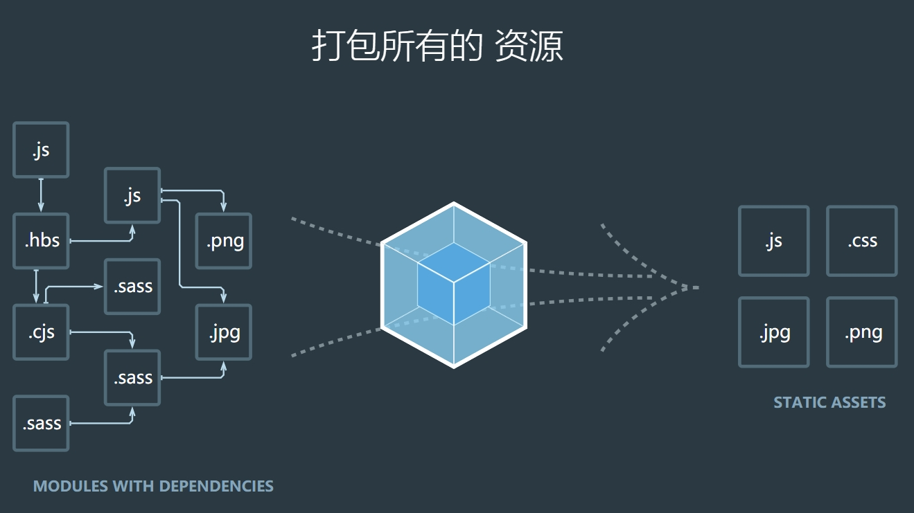

## webpack4+入门笔记
---
### [webpack](https://www.webpackjs.com/)简介：



>本质上，webpack 是一个现代 JavaScript 应用程序的静态模块打包器(module bundler)。当 webpack 处理应用程序时，它会递归地构建一个依赖关系图(dependency graph)，其中包含应用程序需要的每个模块，然后将所有这些模块打包成一个或多个 bundle。

可以理解为就是一个打包工具，帮助我们将各种文件例如css,less,sass,js,ts,jpg,png等文件有序打包在一起。

***
### 核心概念：
  1. Entry：入口起点(entry point)指示 webpack 应该使用哪个模块，来作为构建其内部依赖图的开始。
  2. Output：output 属性告诉 webpack 在哪里输出它所创建的 bundles，以及如何命名这些文件，默认值为 ./dist。
  3. Loader：loader 让 webpack 能够去处理那些非 JavaScript 文件（webpack 自身只能解析 JavaScript）。
  4. Plugins：插件则可以用于执行范围更广的任务。插件的范围包括，从打包优化和压缩，一直到重新定义环境中的变量等。
  5. Mode：模式，有生产模式production和开发模式development。
   
***

### 项目开始前准备

> 安装好node和npm工具，了解基本的npm使用方法，cnpm，npx等工具使用。

*  自定义生成package.json文件：
```
{
    "name":"webpack",
    "version":"1.0.0"
}
```
* 或者使用npm init命令自动搭建环境。其中包括很多详细配置如：name，version，author等可以先不用关注，确认生成即可。
  

>webpack安装：

```
npm install webpack webpack-cli -g //全局安装
或 npm install webpack webpack-cli -D //本地安装
```
***

### 简单编译打包
```
webpack ./src/index.js -o ./dist/bundle.js --mode=development
/*这里的意思是在开发模式下，将./src/index.js 打包输出成 ./dist/bundle.js 文件*/

webpack ./src/index.js -o ./dist/bundle.js --mode=production 
/*功能相似，模式变为生产模式，代码会被压缩*/
```  
webpack可以直接对js、json文件进行打包输出，能将es6的模块化语法转换成浏览器能识别的语法，但是对css、less等其他文件需要加载器的帮助下才能打包，

***

### 使用webpack.config.js配置文件
webpack.config.js是webpack的一个配置文件，指示webpack运行，帮助webpack更加方便的运行。
* 新建文件 webpack.config.js
* 基本写法
  
```
const path=require('path');   //引入node内置模块中的resolve方法来配置路径

module.exports={
  entry:'./src/index.js',   //入口文件
  output:{                  //输出文件
    filename:'bundle.js',
    path:path.resolve(__dirname,'dist')
  },
  module:{                 //加载器
    rules:[]               //详细配置
  },
  plugins:[],             //插件
  mode:'development'        //模式，或者使用production
}
```
***

### 打包样式资源
> 普通css资源文件
1. 首先需要在入口文件引入css文件资源,例如：
```
//index.js文件中引入index.css
import './src/index.css';
```
2. 先在终端下载好需要的loader
```
npm install css-loader style-loader --save-dev
```
3. 在webpack.config.js文件中的module进行配置
```
module:{
  rules:[
    {
      test:/\.css$/,
      use:['style-loader','css-loader']
    }
  ]
}
```
需要注意的是，use数组中loader的执行顺序是从右到左，从上到下。其中，style-loader可以创建style标签，将js中引入的样式资源添加到html文件的head中；css-loader是将css文件变成commonjs模块加载到js中，里面是样式字符串。

4. 配置好了在终端使用命令:webpack 进行打包。

>less资源文件

less资源文件的处理大致与上面css文件相同。
1. 在index.js引入less文件
2. 先在终端下载好需要的loader
```
npm install css-loader style-loader less-loader --save-dev
```
style-loader和css-loader可以不用重复下载。

3. 在webpack.config.js文件中的module进行配置
```
module:{
  rules:[
    {
      test:/\.css$/,
      use:['style-loader','css-loader']
    },
    {
      test:/\.less$/,
      use:['style-loader','css-loader','less-loader']
    }
  ]
}
```

4. 配置好了在终端使用命令:webpack 进行打包。
  
***
### 打包html文件
1. 编写原来的html文件，不需要引入其他css和js文件。
2. 在终端里下载好需要用到的插件html-webpack-plugin
```
npm install html-webpack-plugin --save-dev
或 npm i html-webpack-plugin -D
// i 是 install 的缩写 ，-D 是 --save-dev 的缩写
```
3. 在webpack.config.js文件中进行配置
```
//首先在文件开头引入需要的插件
const HtmlWebpackPlugin=require('html-webpack-plugin');

//在plugins中修改：
plugins:[
  new HtmlWebpackPlugin ({
    template:'./src/index.html'
  })
]
```  
该插件可以复制template中的html文件，自动引入打包后的资源。

4. 配置好了在终端使用命令:webpack 进行打包。

***


### 打包图片资源
> 打包样式资源中的图片资源
1. 在终端下载好需要用到的loader
```
npm i file-loader url-loader -D
//url-loader依赖于file-loader，使用时需要一起使用
```
2. 在webpack.config.js文件的module中进行配置
```
{
  test: /\.(png|jpg|gif|svg)$/,
  use: [
    {
      loader: 'url-loader',
      options: {
        outputPath: 'images/',          //在output基础上，修改输出图片文件的位置
        publicPath: '../dist/images/',  //修改背景图引入url的路径
        limit: 8 * 1024,                // 8kb大小以下的图片文件都用base64处理
        name: '[hash:8].[ext]'          // hash值为7位，ext自动补全文件扩展名
        esModule:false;                 //关闭url-loader的es6模块化，防止与commomjs的模块化冲突，新版本修改了可以不用
      }
    }
  ]
}
```
3.配置好了在终端使用命令:webpack 进行打包。


>打包html文件中的图片资源

1. 在终端下载好需要用到的loader
```
npm i html-loader -D
```
2. 在webpack.config.js文件的module中进行配置
```
{
  test: /\.html$/,
  use: {
    loader: 'html-loader'
  }
}
```
3.配置好了在终端使用命令:webpack 进行打包。

***
   
### 打包其他资源
1. 将相应资源放进目录。
2. 在index.js引入iconfont.css 文件
3. 使用到的资源文件添加到html中。
4. 在终端中下载需要到的file-loader
5. 在webpack.config.js文件的module中进行配置

```
{
  exclude: [/\.(css|js|json|html)/],    //不处理这些资源
  loader: 'file-loader',
  options: {
    outputPath: 'media/',
    publicPath: '../dist/media/',
    name: '[hash:8].[ext]',
  },
}
```
6. 配置好了在终端使用命令:webpack 进行打包。

***

### 自动编译打包--devSever

devserver可以自动编译打包，不用我们重复执行webpack命令，适合开发使用，但是需要注意，它只在内存中运行，不会有输出，即不会有output存在。

1. 在终端中下载需要的资源
```
npm i webpack-dev-server -D
```
2. 启动：
> 使用npx启动
```
npx webpack-dev-server
``` 
>配置脚本启动

修改package.json中scripts指令
```
"start": "webpack-dev-server",
"dev": "webpack-dev-server"
```
终端运行指令：npm start / npm run dev

3. 在webpack.config.js中进行配置
```
//注意，不在loader中修改
devServer{
  contentBase:resolve(__dirname,'dist'),
  compress:true,          //使用gzip压缩
  port：3000,
  open:true               //自动打开浏览器
}
```
***

### 开发环境基本配置
1. 需要下载好需要的loader和插件
2. webpack.config.js 配置：
```
const path = require('path');
const HtmlWebpackPlugin=require('html-webpack-plugin');

module.exports={
    entry:'./src/index.js',
    output:{
        filename:'bundle.js',
        path: path.resolve(__dirname, 'dist')
    },
    module: {
       rules:[{
           test:/\.css$/,
           use:['style-loader','css-loader']
       },
       {
           test:/\.less$/,
           use:['style-loader','css-loader','less-loader']
       },
       {
           test:/\.(jpg|png|gif)/,
           loader:'url-loader',
           options:{
               limit:8*1024,
               name:'[hash:10].[ext]',
               esModule:false
           }
       },
       {
           test:/\.html$/,
           loader:'html-loader'
       },
       {
           exclude:/\.(html|js|css|less|jpg|png|gif)/,
           loader:'file-loader',
           options:{
               name:'[hash:10].[ext]'
           }
       }
    ]

    },
    plugins:[
        new HtmlWebpackPlugin({
            template:'./src/index.html'
        })
    ],
   mode:'development',
   devServer:{
    contentBase:path.resolve(__dirname,'dist'),
    compress:true,
    port:3000,
    open:true,
   }
}
```

***
### 参考资料
<a href='https://segmentfault.com/a/1190000018534625'>从零开始的Webpack4教程</a>

<a href='https://www.bilibili.com/video/BV1e7411j7T5'>
尚硅谷2020最新版Webpack5实战教程(从入门到精通)</a>
