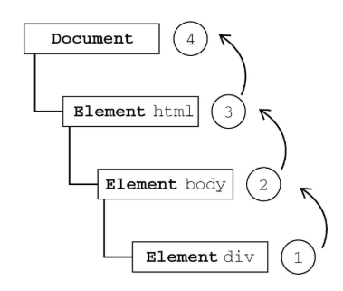

### 事件--了解即可，掌握EventUtil
#### 事件流
1. 事件冒泡

即事件开始时由具体的元素（文档中嵌套层次最深的那个节点）接受，然后逐级向上传播到较为不具体的节点（文档）。



2. 事件捕获

事件捕获的思想是不太具体的节点应该更早接收到事件，而最具体的节点应该最后接收到事件。


3. DOM 事件流

“DOM2级事件”规定的事件流包括三个阶段：事件捕获阶段、处于目标阶段和事件冒泡阶段。


#### 事件处理程序

事件是用户操作网页时发生的交互动作或者网页本身的一些操作，现代浏览器一共有三种事件模型。

0. html事件（onclick）

1. 第一种事件模型是最早的 DOM0 级模型，这种模型不会传播，所以没有事件流的概念，但是现在有的浏览器支持以冒泡的方式实
现，它可以在网页中直接定义监听函数，也可以通过 js 属性来指定监听函数。这种方式是所有浏览器都兼容的。（getElementById，XX.onclick）

2. 第二种事件模型是 IE 事件模型，在该事件模型中，一次事件共有两个过程，事件处理阶段，和事件冒泡阶段。事件处理阶段会首先执行目标元素绑定的监听事件。然后是事件冒泡阶段，冒泡指的是事件从目标元素冒泡到 document，依次检查经过的节点是否绑定了事件监听函数，如果有则执行。这种模型通过 attachEvent 来添加监听函数，可以添加多个监听函数，会按顺序依次执行。（attachEvent(事件名、处理函数)、detachEvent(事件名、处理函数)---均为冒泡阶段）

3. 第三种是 DOM2 级事件模型，在该事件模型中，一次事件共有三个过程，第一个过程是事件捕获阶段。捕获指的是事件从 document 一直向下传播到目标元素，依次检查经过的节点是否绑定了事件监听函数，如果有则执行。后面两个阶段和 IE 事件模型的两个阶段相同。这种事件模型，事件绑定的函数是 addEventListener，其中第三个参数可以指定事件是否在捕获阶段执行。(addEventListener(事件名,处理函数,bool)、removeEventListener(事件名、处理函数、bool)、true 表示在捕获阶段调用，false 表示在事件冒泡阶段调用)

```
//跨浏览器事件处理程序

var EventUtil={
    addHandler:function(element,type,handler){
        if(element.addEventListener){
            element.addEventListener(type,handler,false)
        }else if(element.attachEvent){
            element.attachEvent("on"+type,handler)
        }else {
            element["on"+type]=handler;
        }
    },
    removeHandler:function(element,type,handler){
        if(element.removeEventListener){
            element.removeEventListener(type,handler,false)
        }else if(element.detachEvent){
            element.detachEvent("on"+type,handler)
        }else{
            element["on"+type]=null
        }
    }
}
```


#### 事件对象
红宝书

### 浏览器相关
####  1.跨域

跨域方式：
* jsonp
1. 首先前端需要先设置好回调函数，并将其作为 url 的参数。
2. 服务端接收到请求后，通过该参数获取到回调函数名，并将数据放在参数中将其返回
3. 收到结果后因为是 script 标签，所以浏览器会当做是脚本进行运行，从而达到跨域获取数据的目的
缺点：只支持get方法。无法捕获jsonp请求时的连接异常，只能通过超时进行处理。

* cors
关键是服务器，在于设置相应头中的 Access-Control-Allow-Origin，该值要与请求头中 Origin 一致才能生效，否则将跨域失败。

* 服务器代理
* postmessage


####  2.浏览器缓存-强缓存、协商缓存。缓存位置。Ajax 解决浏览器缓存问题
强制缓存：浏览器不会像服务器发送任何请求，直接从本地缓存中读取文件并返回Status Code: 200 OK

Expires：过期时间，如果设置了时间，则浏览器会在设置的时间内直接读取缓存，不再请求（1.0）

Cache-Control：当值设为max-age=300时，则代表在这个请求正确返回时间（浏览器也会记录下来）的5分钟内再次加载资源，就会命中强缓存。（1.1）

协商缓存: 向服务器发送请求，服务器会根据这个请求的request header的一些参数来判断是否命中协商缓存，如果命中，则返回304状态码并带上新的response header通知浏览器从缓存中读取资源；

Last-Modifed/If-Modified-Since 和 Etag/If-None-Match是分别成对出现的，呈一一对应关系

**********

浏览器的缓存机制指的是通过在一段时间内保留已接收到的 web 资源的一个副本，如果在资源的有效时间内，发起了对这个资源的再一次请求，那么浏览器会直接使用缓存的副本，而不是向服务器发起请求。使用 web 缓存可以有效地提高页面的打开速度，减少不必要的网络带宽的消耗。

web 资源的缓存策略一般由服务器来指定，可以分为两种，分别是强缓存策略和协商缓存策略。

使用强缓存策略时，如果缓存资源有效，则直接使用缓存资源，不必再向服务器发起请求。强缓存策略可以通过两种方式来设置，分别是 http 头信息中的 Expires 属性和 Cache-Control 属性。

服务器通过在响应头中添加 Expires 属性，来指定资源的过期时间。在过期时间以内，该资源可以被缓存使用，不必再向服务器发送请求。这个时间是一个绝对时间，它是服务器的时间，因此可能存在这样的问题，就是客户端的时间和服务器端的时间不一致，或者用户可以对客户端时间进行修改的情况，这样就可能会影响缓存命中的结果。

Expires 是 http1.0 中的方式，因为它的一些缺点，在 http 1.1 中提出了一个新的头部属性就是 Cache-Control 属性，
它提供了对资源的缓存的更精确的控制。它有很多不同的值，常用的比如我们可以通过设置 max-age 来指定资源能够被缓存的时间
的大小，这是一个相对的时间，它会根据这个时间的大小和资源第一次请求时的时间来计算出资源过期的时间，因此相对于 Expires
来说，这种方式更加有效一些。常用的还有比如 private ，用来规定资源只能被客户端缓存，不能够代理服务器所缓存。还有如 n
o-store ，用来指定资源不能够被缓存，no-cache 代表该资源能够被缓存，但是立即失效，每次都需要向服务器发起请求。

一般来说只需要设置其中一种方式就可以实现强缓存策略，当两种方式一起使用时，Cache-Control 的优先级要高于 Expires 。

使用协商缓存策略时，会先向服务器发送一个请求，如果资源没有发生修改，则返回一个 304 状态，让浏览器使用本地的缓存副本。
如果资源发生了修改，则返回修改后的资源。协商缓存也可以通过两种方式来设置，分别是 http 头信息中的 Etag 和 Last-Modified 属性。

服务器通过在响应头中添加 Last-Modified 属性来指出资源最后一次修改的时间，当浏览器下一次发起请求时，会在请求头中添加一个 If-Modified-Since 的属性，属性值为上一次资源返回时的 Last-Modified 的值。当请求发送到服务器后服务器会通过这个属性来和资源的最后一次的修改时间来进行比较，以此来判断资源是否做了修改。如果资源没有修改，那么返回 304 状态，让客户端使用本地的缓存。如果资源已经被修改了，则返回修改后的资源。使用这种方法有一个缺点，就是 Last-Modified 标注的最后修改时间只能精确到秒级，如果某些文件在1秒钟以内，被修改多次的话，那么文件已将改变了但是 Last-Modified 却没有改变，
这样会造成缓存命中的不准确。

因为 Last-Modified 的这种可能发生的不准确性，http 中提供了另外一种方式，那就是 Etag 属性。服务器在返回资源的时候，在头信息中添加了 Etag 属性，这个属性是资源生成的唯一标识符，当资源发生改变的时候，这个值也会发生改变。在下一次资源请求时，浏览器会在请求头中添加一个 If-None-Match 属性，这个属性的值就是上次返回的资源的 Etag 的值。服务接收到请求后会根据这个值来和资源当前的 Etag 的值来进行比较，以此来判断资源是否发生改变，是否需要返回资源。通过这种方式，比 Last-Modified 的方式更加精确。

当 Last-Modified 和 Etag 属性同时出现的时候，Etag 的优先级更高。使用协商缓存的时候，服务器需要考虑负载平衡的问题，因此多个服务器上资源的 Last-Modified 应该保持一致，因为每个服务器上 Etag 的值都不一样，因此在考虑负载平衡时，最好不要设置 Etag 属性。

强缓存策略和协商缓存策略在缓存命中时都会直接使用本地的缓存副本，区别只在于协商缓存会向服务器发送一次请求。它们缓存不命中时，都会向服务器发送请求来获取资源。在实际的缓存机制中，强缓存策略和协商缓存策略是一起合作使用的。浏览器首先会根据请求的信息判断，强缓存是否命中，如果命中则直接使用资源。如果不命中则根据头信息向服务器发起请求，使用协商缓存，如果协商缓存命中的话，则服务器不返回资源，浏览器直接使用本地资源的副本，如果协商缓存不命中，则浏览器返回最新的资源给浏览器。


https://juejin.im/post/6844903838768431118
https://github.com/CavsZhouyou/Front-End-Interview-Notebook/blob/master/JavaScript/JavaScript.md#56-%E8%B0%88%E4%B8%80%E8%B0%88%E6%B5%8F%E8%A7%88%E5%99%A8%E7%9A%84%E7%BC%93%E5%AD%98%E6%9C%BA%E5%88%B6


####  3.浏览器内核、渲染过程、回流、重绘、

##### 浏览器的渲染过程
 （1）首先解析收到的文档，根据文档定义构建一棵 DOM 树，DOM 树是由 DOM 元素及属性节点组成的。

 （2）然后对 CSS 进行解析，生成 CSSOM 规则树。

 （3）根据 DOM 树和 CSSOM 规则树构建渲染树。渲染树的节点被称为渲染对象，渲染对象是一个包含有颜色和大小等属性的矩
     形，渲染对象和 DOM 元素相对应，但这种对应关系不是一对一的，不可见的 DOM 元素不会被插入渲染树。还有一些 DOM 
     元素对应几个可见对象，它们一般是一些具有复杂结构的元素，无法用一个矩形来描述。

 （4）当渲染对象被创建并添加到树中，它们并没有位置和大小，所以当浏览器生成渲染树以后，就会根据渲染树来进行布局（也
     可以叫做回流）。这一阶段浏览器要做的事情是要弄清楚各个节点在页面中的确切位置和大小。通常这一行为也被称为“自动
     重排”。

 （5）布局阶段结束后是绘制阶段，遍历渲染树并调用渲染对象的 paint 方法将它们的内容显示在屏幕上，绘制使用 UI 基础组
     件。

  值得注意的是，这个过程是逐步完成的，为了更好的用户体验，渲染引擎将会尽可能早的将内容呈现到屏幕上，并不会等到所有的
  html 都解析完成之后再去构建和布局 render 树。它是解析完一部分内容就显示一部分内容，同时，可能还在通过网络下载其
  余内容。

##### 什么是回流和重绘
重绘: 当渲染树中的一些元素需要更新属性，而这些属性只是影响元素的外观、风格，而不会影响布局的操作，比如 background
       -color，我们将这样的操作称为重绘。
 
 回流：当渲染树中的一部分（或全部）因为元素的规模尺寸、布局、隐藏等改变而需要重新构建的操作，会影响到布局的操作，这样
      的操作我们称为回流。

 常见引起回流属性和方法：

 任何会改变元素几何信息（元素的位置和尺寸大小）的操作，都会触发回流。

 （1）添加或者删除可见的 DOM 元素；
 （2）元素尺寸改变——边距、填充、边框、宽度和高度
 （3）内容变化，比如用户在 input 框中输入文字
 （4）浏览器窗口尺寸改变——resize事件发生时
 （5）计算 offsetWidth 和 offsetHeight 属性
 （6）设置 style 属性的值
 （7）当你修改网页的默认字体时。

 回流必定会发生重绘，重绘不一定会引发回流。回流所需的成本比重绘高的多，改变父节点里的子节点很可能会导致父节点的一系列
 回流。

####  4.浏览器性能优化

前端性能优化主要是为了提高页面的加载速度，优化用户的访问体验。我认为可以从这些方面来进行优化。

 第一个方面是页面的内容方面

 （1）通过文件合并、css 雪碧图、使用 base64 等方式来减少 HTTP 请求数，避免过多的请求造成等待的情况。

 （2）通过 DNS 缓存等机制来减少 DNS 的查询次数。

 （3）通过设置缓存策略，对常用不变的资源进行缓存。

 （4）使用延迟加载的方式，来减少页面首屏加载时需要请求的资源。延迟加载的资源当用户需要访问时，再去请求加载。

 （5）通过用户行为，对某些资源使用预加载的方式，来提高用户需要访问资源时的响应速度。

 第二个方面是服务器方面

 （1）使用 CDN 服务，来提高用户对于资源请求时的响应速度。

 （2）服务器端启用 Gzip、Deflate 等方式对于传输的资源进行压缩，减小文件的体积。

 （3）尽可能减小 cookie 的大小，并且通过将静态资源分配到其他域名下，来避免对静态资源请求时携带不必要的 cookie

 第三个方面是 CSS 和 JavaScript 方面

 （1）把样式表放在页面的 head 标签中，减少页面的首次渲染的时间。

 （2）避免使用 @import 标签。

 （3）尽量把 js 脚本放在页面底部或者使用 defer 或 async 属性，避免脚本的加载和执行阻塞页面的渲染。

 （4）通过对 JavaScript 和 CSS 的文件进行压缩，来减小文件的体积。

####  5.本地存储。cookie、sessionstorage、localstorage、IndexDB

1. SessionStorage， LocalStorage， Cookie 这三者都可以被用来在浏览器端存储数据，而且都是字符串类型的键值对。区别
 在于前两者属于 HTML5 WebStorage，创建它们的目的便于客户端存储数据。而 cookie 是网站为了标示用户身份而储存在用户
 本地终端上的数据（通常经过加密）。cookie 数据始终在同源（协议、主机、端口相同）的 http 请求中携带（即使不需要），会
 在浏览器和服务器间来回传递。
 
 
 存储大小：
   	cookie 数据大小不能超过4 k 。
   	sessionStorage 和 localStorage 虽然也有存储大小的限制，但比 cookie 大得多，可以达到 5M 或更大。

 有期时间：
   	localStorage    存储持久数据，浏览器关闭后数据不丢失除非主动删除数据。
   	sessionStorage  数据在页面会话结束时会被清除。页面会话在浏览器打开期间一直保持，并且重新加载或恢复页面仍会
                     保持原来的页面会话。在新标签或窗口打开一个页面时会在顶级浏览上下文中初始化一个新的会话。
   	cookie          设置的 cookie 过期时间之前一直有效，即使窗口或浏览器关闭。
  
 作用域：
     sessionStorage  只在同源的同窗口（或标签页）中共享数据，也就是只在当前会话中共享。
     localStorage    在所有同源窗口中都是共享的。
     cookie          在所有同源窗口中都是共享的。

2. 浏览器端常用的存储技术是 cookie 、localStorage 和 sessionStorage。

 cookie 其实最开始是服务器端用于记录用户状态的一种方式，由服务器设置，在客户端存储，然后每次发起同源请求时，发送给服
 务器端。cookie 最多能存储 4 k 数据，它的生存时间由 expires 属性指定，并且 cookie 只能被同源的页面访问共享。

 sessionStorage 是 html5 提供的一种浏览器本地存储的方法，它借鉴了服务器端 session 的概念，代表的是一次会话中所保
 存的数据。它一般能够存储 5M 或者更大的数据，它在当前窗口关闭后就失效了，并且 sessionStorage 只能被同一个窗口的同源
 页面所访问共享。

 localStorage 也是 html5 提供的一种浏览器本地存储的方法，它一般也能够存储 5M 或者更大的数据。它和 sessionStorage 
 不同的是，除非手动删除它，否则它不会失效，并且 localStorage 也只能被同源页面所访问共享。

 上面几种方式都是存储少量数据的时候的存储方式，当我们需要在本地存储大量数据的时候，我们可以使用浏览器的 indexDB 这是浏
 览器提供的一种本地的数据库存储机制。它不是关系型数据库，它内部采用对象仓库的形式存储数据，它更接近 NoSQL 数据库。

3. 我的理解是 cookie 是服务器提供的一种用于维护会话状态信息的数据，通过服务器发送到浏览器，浏览器保存在本地，当下一次有同源的请求时，将保存的 cookie 值添加到请求头部，发送给服务端。这可以用来实现记录用户登录状态等功能。cookie 一般可以存储 4k 大小的数据，并且只能够被同源的网页所共享访问。

服务器端可以使用 Set-Cookie 的响应头部来配置 cookie 信息。一条cookie 包括了5个属性值 expires、domain、path、secure、HttpOnly。其中 expires 指定了 cookie 失效的时间，domain 是域名、path是路径，domain 和 path 一起限制了 cookie 能够被哪些 url 访问。secure 规定了 cookie 只能在确保安全的情况下传输，HttpOnly 规定了这个 cookie 只能被服务器访问，不能使用 js 脚本访问。

在发生 xhr 的跨域请求的时候，即使是同源下的 cookie，也不会被自动添加到请求头部，除非显示地规定。

#### 浏览器的同源政策
我对浏览器的同源政策的理解是，一个域下的 js 脚本在未经允许的情况下，不能够访问另一个域的内容。这里的同源的指的是两个
域的协议、域名、端口号必须相同，否则则不属于同一个域。

同源政策主要限制了三个方面

第一个是当前域下的 js 脚本不能够访问其他域下的 cookie、localStorage 和 indexDB。

第二个是当前域下的 js 脚本不能够操作访问操作其他域下的 DOM。

第三个是当前域下 ajax 无法发送跨域请求。

同源政策的目的主要是为了保证用户的信息安全，它只是对 js 脚本的一种限制，并不是对浏览器的限制，对于一般的 img、或者
script 脚本请求都不会有跨域的限制，这是因为这些操作都不会通过响应结果来进行可能出现安全问题的操作。

####  短轮询、长轮询、websocket、webworker

#### 安全问题

### 操作系统

#### 1. 进程&线程

1.进程，是并发执行的程序在执行过程中分配和管理资源的基本单位，是一个动态概念，竞争计算机系统资源的基本单位。


2.线程，是进程的一部分，一个没有线程的进程可以被看作是单线程的。线程有时又被称为轻权进程或轻量级进程，也是 CPU 调度的一个基本单位。


一个程序至少有一个进程，一个进程至少有一个线程，资源分配给进程，同一个进程下所有线程共享该进程的资源


#### 2. 那些资源共享、那些不共享
1.共享的资源有

1.堆：由于堆是在进程空间中开辟出来的，所以它是理所当然地被共享的；因此new出来的都是共享的（16位平台上分全局堆和局部堆，局部堆是独享的）
2.全局变量：它是与具体某一函数无关的，所以也与特定线程无关；因此也是共享的
3.静态变量：虽然对于局部变量来说，它在代码中是“放”在某一函数中的，但是其存放位置和全局变量一样，存于堆中开辟的.bss和.data段，是共享的
4.文件等公用资源：这个是共享的，使用这些公共资源的线程必须同步。Win32 提供了几种同步资源的方式，包括信号、临界区、事件和互斥体。


2.独享的资源有

1.栈：栈是独享的
2.寄存器：这个可能会误解，因为电脑的寄存器是物理的，每个线程去取值难道不一样吗？其实线程里存放的是副本，包括程序计数器PC


#### 3. 通信方式

1.无名管道：半双工的通信方式，数据只能单向流动且只能在具有亲缘关系的进程间使用
2.高级管道：将另一个程序当作一个新的进程在当前程序进程中启动，则这个进程算是当前程序的子进程，
3.有名管道，：也是半双工的通信方式，但是允许没有亲缘进程之间的通信
4.消息队列：消息队列是有消息的链表，存放在内核中，并由消息队列标识符标识，消息队列克服了信号传递信息少，管道只能承载无格式字节流以及缓冲区大小受限的缺点
5.信号量：信号量是一个计数器，可以用来控制多个进程对共享资源的访问，它常作为一种锁机制，防止某进程正在访问共享资源时，其他进程也访问该资源，
6.信号：用于通知接受进程某个事件已经发生
7.共享内存：共享内存就是映射一段能被其他进程所访问的内存。这段共享内存由一个进程创建，但是多个进程可以访问，共享内存是最快的IPC 方式，往往与其他通信机制配合使用
8.套接字：可用于不同机器之间的进程通信

### js总结相关
#### 垃圾回收 ： v8 javascript
###### v8
v8 的垃圾回收机制基于分代回收机制，这个机制又基于世代假说，这个假说有两个特点，一是新生的对象容易早死，另一个是不死的对象会活得更久。基于这个假说，v8 引擎将内存分为了新生代和老生代。

新创建的对象或者只经历过一次的垃圾回收的对象被称为新生代。经历过多次垃圾回收的对象被称为老生代。

新生代被分为 From 和 To 两个空间，To 一般是闲置的。当 From 空间满了的时候会执行 Scavenge 算法进行垃圾回收。当我们执行垃圾回收算法的时候应用逻辑将会停止，等垃圾回收结束后再继续执行。这个算法分为三步：

（1）首先检查 From 空间的存活对象，如果对象存活则判断对象是否满足晋升到老生代的条件，如果满足条件则晋升到老生代。如果不满足条件则移动 To 空间。

（2）如果对象不存活，则释放对象的空间。

（3）最后将 From 空间和 To 空间角色进行交换。

新生代对象晋升到老生代有两个条件：

（1）第一个是判断是对象否已经经过一次 Scavenge 回收。若经历过，则将对象从 From 空间复制到老生代中；若没有经历，则复制到 To 空间。

（2）第二个是 To 空间的内存使用占比是否超过限制。当对象从 From 空间复制到 To 空间时，若 To 空间使用超过 25%，则对象直接晋升到老生代中。设置 25% 的原因主要是因为算法结束后，两个空间结束后会交换位置，如果 To 空间的内存太小，会影响后续的内存分配。

老生代采用了标记清除法和标记压缩法。标记清除法首先会对内存中存活的对象进行标记，标记结束后清除掉那些没有标记的对象。由于标记清除后会造成很多的内存碎片，不便于后面的内存分配。所以了解决内存碎片的问题引入了标记压缩法。

由于在进行垃圾回收的时候会暂停应用的逻辑，对于新生代方法由于内存小，每次停顿的时间不会太长，但对于老生代来说每次垃圾回收的时间长，停顿会造成很大的影响。 为了解决这个问题 V8 引入了增量标记的方法，将一次停顿进行的过程分为了多步，每次执行完一小步就让运行逻辑执行一会，就这样交替运行。

###### javascript
引用计数、标记清除


#### for of vs for in

#### 二分查找

```
function binarySearch(target,arr,start,end){
    if(start>end)   return -1
    let start=start || 0
    let end=end || arr.length-1

    let mid=Math.floor((start+end)/2)
    if(target==arr[mid]){
        return mid
    }else if(target>arr[mid]){
        return binarySearch(target,arr,mid+1,end)
    }else if(target<arr[mid]){
        return binarySearch(target,arr,start,mid-1)
    }
    return -1
}


function binarySearch(target,arr){
    let start=0
    let end=arr.length-1
    while(start<=end){
        let mid=Math.floor((start+end)/2)
        if(target==arr[mid]){
            return mid
        }else if(target>arr[mid]){
            start=mid+1
        }else {
            end=mid-1
        }
    }
    return -1
}
```

#### 排序算法

##### 1. 冒泡排序
```
//冒泡排序  复杂度:O(n**2),空间复杂度：O(1),稳定
function bubbleSort(arr){
    for(let i=0;i<arr.length-1;i++){
        for(let j=0;j<arr.length-1;j++){
            if(arr[j]>arr[j+1]){
                [arr[j],arr[j+1]]=[arr[j+1],arr[j]]
            }
        }
    }
    return arr
}

//简单优化
function bubbleSort(arr){
    
    for(let i=0;i<arr.length;i++){
        let flag=true
        for(let j=0;j<arr.length-1-i;j++){
            if(arr[j]>arr[j+1]){
                [arr[j],arr[j+1]]=[arr[j+1],arr[j]]
                flag=false
            }
        }
        if(flag){
            break;
        }
    }
    return arr
}
```

##### 2.选择排序

```

//选择排序  复杂度:O(n**2),空间复杂度：O(1),不稳定
function selectSort(arr){
    for(let i=0;i<arr.length-1;i++){
        let minIndex=i
        for(let j=i+1;i<arr.length;j++){
            if(arr[minIndex]>arr[j]){
                minIndex=j
            }
        }
        [arr[i],arr[minIndex]]=[arr[minIndex],arr[i]]
    }
    return arr
}

```

##### 3.插入排序

```
//插入排序      复杂度:O(n**2),空间复杂度：O(1),稳定
function insertSort(arr){
    for(let i=1;i<arr.length;i++){
        let cur=arr[i]
        for(let j=i-1;j>=0;j--){
            if(cur<a[j]){
                a[j+1]=a[j]
            }else{
                break;
            }
            a[j]=cur
        }
    }
    return arr
}

```

##### 4.归并排序
复杂度：O(nlogn) 时间复杂度：O(n),稳定

```
//写法一：写法简单，但是需要复制多个数组，空间复杂度稍高
functino mergeSort(arr){
    if(arr.length<2){
        return arr
    }
    let mid=Math.floor(arr.length/2)
    let front=arr.slice(0,mid)
    let end=arr.slice(mid)
    return merge(mergeSort(front),mergeSort(end))
}
function merge(front,end){
    let temp=[]
    while(front.length && end.length){
        if(front[0]<end[0]){
            temp.push(front.shift())
        }else{
            temp.push(end.shift())
        }
    }
    while(front.length){
        temp.push(front.shift())
    }
    while(end.length){
        temp.push(end.shift())
    }
    return temp
}

//写法二：写法复杂，但是只需要一个temp的辅助空间
function mergeSort(arr,left,right,temp){
    if(left < right){
        let mid=Math.floor((left+right)/2)
        mergeSort(arr,left,mid,temp)
        mergeSort(arr,mid+1,right,temp)
        merge(arr,left,right,temp)
    }
    return arr
}
function merge(arr,left,right,temp){
    let mid=Math.floor((left+right)/2)
    let leftIndex=left
    let rightIndex=mid+1
    let tempIndex=0
    while(leftIndex <= mid && rightIndex <= right){
        if(arr[leftIndex]<arr[rightIndex]){
            temp[tempIndex++]=arr[leftIndex++]
        }else{
            temp[tempIndex++]=arr[rightIndex++]
        }
    }
    while(leftIndex <= mid){
        temp[tempIndex++]=arr[leftIndex++]
    }
    while(rightIndex <= right){
        temp[tempIndex++]=arr[rightIndex++]
    }

    tempIndex=0
    for(let i=left,i<=right;i++){
        arr[i]=temp[tempIndex++]
    }
}
```

##### 5.快速排序

时间复杂度：平均O(nlogn)，最坏O(n2)，实际上大多数情况下小于O(nlogn)

空间复杂度:O(logn)（递归调用消耗）,不稳定

```
//写法一：写法简单，但是浪费大量空间
function quickSort(arr){
    if(arr.length<2){
        return arr
    }
    let target=arr[0]
    let left=[]
    let right=[]
    for(let i=1;i<arr.length;i++){
        if(arr[i]<target){
            left.push(arr[i])
        }else{
            right.push(arr[i])
        }
    }
    return quickSort(left).concat([target],quickSort(right))
}

//写法二：
function quickSort(arr,start,end){
    if(end-start <1){
        return
    }
    let target=arr[start]
    let l=start
    let r=end
    while(l<r){
        while(l<r && arr[r]>=target){
            r--;
        }
        while(l<r && arr[l]<target){
            l++
        }
        arr[r]=arr[l]
    }
    arr[l]=target
    quickSort(arr,start,l-1)
    quickSort(arr,l+1,end)
    return arr
}
```

##### 6.堆排序
##### 7.希尔排序（分组版插入排序）
##### 8.基数排序


