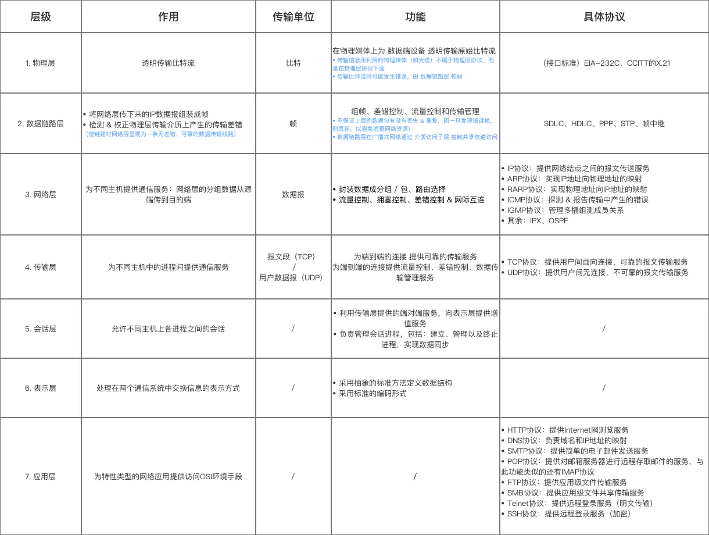

## 计算机网络总结
这篇文章总结了几位大佬的博客，按照自己的思路将计算机网络的知识点进行了一个整理归纳。<br>

文章的主要内容：
* 计算机网络体系结构
* 应用层：
  * http简介、报文详解、常见状态码、常见头部、版本差异
  * https
  * DNS协议
* 传输层：
  * TCP
  * UDP
* web安全问题
* 部分面试题目
  

### 计算机网络体系结构

计算机网络的体系结构可以分为三种：

* OSI体系：概念清楚，理念完整，但是比较复杂不实用。
* TCP/IP体系：含有一系列构成互联网基础的网络协议，是Internet的核心协议，被广泛应用于局域网和广域网。
* 五层体系结构：融合了OSI和TCP/IP的体系结构，目的是为了学习和讲解原理。

> 三种体系结构：
> 
> 

#### TCP/IP体系结构分析：
 
> 

#### OSI体系结构分析：

> 

#### 五层体系结构分析:

> * 应用层:应用层(application-layer）的任务是通过应用进程间的交互来完成特定网络应用。应用层协议定义的是应用进程（进程：主机中正在运行的程序）间的通信和交互的规则。对于不同的网络应用需要不同的应用层协议。在互联网中应用层协议很多，如域名系统 DNS，支持万维网应用的 HTTP 协议，支持电子邮件的 SMTP 协议等等。我们把应用层交互的数据单元称为报文。
> * 运输层：运输层(transport layer)的主要任务就是负责向两台主机进程之间的通信提供通用的数据传输服务。主要使用TCP/UDP协议进行传输。
> * 网络层：网络层(network layer)负责为分组交换网上的不同主机提供通信服务。 在发送数据时，网络层把运输层产生的报文段或用户数据报封装成分组和包进行传送。在 TCP/IP 体系结构中，由于网络层使用 IP 协议，因此分组也叫 IP 数据报 ，简称 数据报。
> * 数据链路层:数据链路层(data link layer)通常简称为链路层。两台主机之间的数据传输，总是在一段一段的链路上传送的，这就需要使用专门的链路层的协议。 在两个相邻节点之间传送数据时，数据链路层将网络层交下来的 IP 数据报组装程帧，在两个相邻节点间的链路上传送帧。每一帧包括数据和必要的控制信息（如同步信息，地址信息，差错控制等）。
> * 物理层：在物理层上所传送的数据单位是比特。 物理层(physical layer)的作用是实现相邻计算机节点之间比特流的透明传送，尽可能屏蔽掉具体传输介质和物理设备的差异。

*** 

### http简介
超文本传输协议，HTTP 是一个在计算机世界里专门在两点之间传输文字、图片、音频、视频等超文本数据的约定和规范。


> http特点
> * 灵活可拓展：一个是语法上只规定了基本格式，空格分隔单词，换行分隔字段等。另外一个就是传输形式上不仅可以传输文本，还可以传输图片，视频等任意数据。
> * 请求-应答模式：通常而言，就是一方发送消息，另外一方要接受消息，或者是做出相应等。
> * 可靠传输：HTTP是基于TCP/IP，因此把这一特性继承了下来。
> * 无状态：不对请求和响应的通信状态进行保存。有时需要保持状态例如保持登录状态等，有时不需要，减少网络开销。

> http缺点：
> * 无状态：无法保持通信状态，每一个请求都需要一次连接。
> * 明文传输：协议里的报文(主要指的是头部)不使用二进制数据，而是文本形式。这让HTTP的报文信息暴露给了外界，给攻击者带来了便利。
> * 队头阻塞：（http1.1）当http开启长连接时，共用一个TCP连接，当某个请求时间过长时，其他的请求只能处于阻塞状态，这就是队头阻塞问题。

### http的报文

#### 请求报文:

> 
> 
> * 请求行：方法字段 + URL字段 + HTTP版本字段
> * 请求头部：声明 客户端、服务器报文的部分信息。下面一节有请求头部的总结
> * 请求实体：存放数据信息
> 
> 

```
实例：
GET / HTTP/1.1
User-Agent: Mozilla/5.0 (Macintosh; Intel Mac OS X 10_10_5)
Accept: */*
```

#### 响应报文

> 
> 
> * 状态行：协议版本字段 + 状态码 + 状态信息
> * 响应头部：跟请求头部类似，声明报文的部分信息，在下一节中一起总结。
> * 响应实体：包含了所请求的对象，是报文的主要内容。
> 
> 

```
实例：
HTTP/1.0 200 OK
Content-Type: text/plain
Content-Length: 137582
Expires: Thu, 05 Dec 1997 16:00:00 GMT
Last-Modified: Wed, 5 August 1996 15:55:28 GMT
Server: Apache 0.84

<html>
  <body>Hello World</body>
</html>
```

### http报文中的方法字段、状态码、请求头部和响应头部

#### 方法字段：

> 方法字段：（详细信息可以参考<a href='https://developer.mozilla.org/zh-CN/docs/Web/HTTP/Methods'>MDN HTTP request methods </a>）
> * GET 请求获取“URL标志的信息”，就是向服务器获取信息
> * POST 为服务器添加信息，通常会造成服务器资源的修改
> * HEAD 请求读取“URL标志信息的首部”，跟GET方法很像，但是在返回的响应中，不包含请求对象
> * PUT 为指定的URL下添加（存储）一个文档，上传文件到服务器
> * DELETE 删除指定URL所标志的信息，删除服务器上的对象
> * TRACE 用于进行环回测试的请求报文
> * CONNECT 用于代理服务器
> * OPTION 请求“选项”

#### 状态码：

> 状态码：（详细信息可以参考<a href='https://developer.mozilla.org/zh-CN/docs/Web/HTTP/Status'>MDN HTTP response status codes</a>）
> 1. 1XX 信息响应/服务器接收到请求，正在处理
> 2. 2XX 成功响应
> * 200 OK：表示从客户端发来的请求在服务器端被正确请求
> * 202 Accepted：请求已经接收到，但还没有进行响应
> * 204 No content：表示请求成功，但是没有资源可以返回
> * 206 Partial Content：表示客户端进行了范围请求，而服务器成功执行了这部分的 GET 请求 响应报文中包含由 Content-Range 指定范围的实体内容。
> 3. 3XX 重定位
> * 301 moved permanently：永久性重定向
> * 302 found：临时性重定向
> * 303 see other：对应当前请求的响应可以在另一个 URI 上被找到，而且客户端应当采用 GET 的方式访问那个资源
> * 304 Not modified：资源未改变
> 4. 4XX 客户端错误
> * 400 bad request：报文存在语法错误
> * 401 unauthorized：发送的请求需要有通过http认证的认证信息
> * 403 forbidden：对请求资源的访问被服务器拒绝
> * 404 not found：在服务器上找不到请求的资源
> 5. 5XX 服务器错误
> * 500 internal server error：服务器端在执行时发送了错误
> * 502 bad gateway：服务器是正常的，但是访问时出现了不知道的错误
> * 503 service unavailable：服务器没有准备好处理请求。 常见原因是服务器因维护或重载而停机。 

#### 头部信息：

> 头部信息：（详细信息可以参考<a href='https://developer.mozilla.org/zh-CN/docs/Web/HTTP/Headers'>MDN HTTP headers</a>）
> 可以分为四种：请求头部、响应头部、通用头部、实体头部。
> 1. 常见的通用头部：
> 
> 
> 
> 2. 常见的请求头部：
> 
> 
> 
> 3. 常见的响应头部：
> 
> 
> 
> 4. 常见的实体头部：
> 
> 

### http的不同版本
####  http1.0

> * 任何格式的内容都可以发送，这使得互联网不仅可以传输文字，还能传输图像、视频、二进制等文件。
> * 除了GET命令，还引入了POST命令和HEAD命令。
> * http请求和回应的格式改变，除了数据部分，每次通信都必须包括头信息（HTTP header），用来描述一些元数据。
> * 只使用 header 中的 If-Modified-Since 和 Expires 作为缓存失效的标准。
> * 不支持断点续传，也就是说，每次都会传送全部的页面和数据。
> * 通常每台计算机只能绑定一个 IP，所以请求消息中的 URL 并没有传递主机名（hostname）

#### http1.1(最主流)

> * 引入了持久连接（ persistent connection），即TCP连接默认不关闭，可以被多个请求复用，不用声明Connection: keep-alive。长连接的连接时长可以通过请求头中的 keep-alive 来设置
> * 引入了管道机制（ pipelining），即在同一个TCP连接里，客户端可以同时发送多个
请求，进一步改进了HTTP协议的效率。
> * HTTP 1.1 中新增加了 E-tag，If-Unmodified-Since, If-Match, If-None-Match 等缓存控制标头来控制缓存失效。
> * 支持断点续传，通过使用请求头中的 Range 来实现。
> * 使用了虚拟网络，在一台物理服务器上可以存在多个虚拟主机（Multi-homed Web Servers），并且它们共享一个IP地址。
> * 新增方法：PUT、 PATCH、 OPTIONS、 DELETE。

> http1.x版本的缺点
> * 在传输数据过程中，所有内容都是明文，客户端和服务器端都无法验证对方的身份，无法保证数据的安全性。
> * HTTP/1.1 版本默认允许复用TCP连接，但是在同一个TCP连接里，所有数据通信是按次序进行的，服务器通常在处理完一个回应后，才会继续去处理下一个，这样子就会造成队头阻塞。
> * http/1.x 版本支持Keep-alive，用此方案来弥补创建多次连接产生的延迟，但是同样会给服务器带来压力，并且的话，对于单文件被不断请求的服务，Keep-alive会极大影响性能，因为它在文件被请求之后还保持了不必要的连接很长时间。

#### http2.0 

> * 二进制分帧: 这是一次彻底的二进制协议，头信息和数据体都是二进制，并且统称为"帧"：头信息帧和数据帧。
> * 头部压缩: HTTP 1.1版本会出现:User-Agent、Cookie、Accept、Server、Range等字段可能会占用几百甚至几千字节，而 Body 却经常只有几十字节，所以导致头部偏重。HTTP 2.0 使用 HPACK 算法进行压缩。
> * 多路复用: 复用TCP连接，在一个连接里，客户端和浏览器都可以同时发送多个请求或回应，且不用按顺序一一对应，这样子解决了队头阻塞的问题。
> * 服务器推送: 允许服务器未经请求，主动向客户端发送资源，即服务器推送。
> * 请求优先级: 可以设置数据帧的优先级，让服务端先处理重要资源，优化用户体验。

### https工作原理
> http不足：
> * 通信使用明文（不加密），内容可能被窃听
> * 不验证通信方的身份，可能遭遇伪装
> * 无法证明报文的完整性，有可能已经被篡改

#### http VS https

> HTTPS 指的是超文本传输安全协议，HTTPS 是基于 HTTP 协议的，不过它会使用 TLS/SSL 来对数据加密。使用 TLS/ SSL 协议，所有的信息都是加密的，第三方没有办法窃听。并且它提供了一种校验机制，信息一旦被篡改，通信的双方会立 刻发现。它还配备了身份证书，防止身份被冒充的情况出现。
> 
> HTTP + 身份验证(非对称加密) + 信息加密(对称加密) + 完整校验(散列算法) = HTTPS 

####  TLS握手过程

> 1. 客户端向服务器发起请求，请求中包含使用的协议版本号、生成的一个随机数、以及客户端支持的加密方法。
> 2. 服务器端接收到请求后，确认双方使用的加密方法、并给出服务器的证书、以及一个服务器生成的随机数
> 3. 客户端确认服务器证书有效后，生成一个新的随机数，并使用数字证书中的公钥，加密这个随机数，然后发给服 务器。并且还会提供一个前面所有内容的 hash 的值，用来供服务器检验。
> 4. 服务器使用自己的私钥，来解密客户端发送过来的随机数。并提供前面所有内容的 hash 值来供客户端检验。
> 5. 客户端和服务器端根据约定的加密方法使用前面的三个随机数，生成对话秘钥，以后的对话过程都使用这个秘钥 来加密信息。

#### 实现原理：

> 主要用到了对称加密、非对称加密和数字证书三个方法。
> 1. 对称加密：
> 双方使用同一个秘钥对数据进行加密和解密。但是存在的问题是，如何保证秘钥传输的安全性，因为秘钥还是会通过网络传输，还是有风险。
> 
> 2. 非对称加密：
> 使用两个秘钥，一个是公钥，一个是私钥。公钥是公开的，私钥是保密的，用私钥加密的数据，只有对应的公钥才能解密，用公钥加密的数据，只有对应的私钥才能解密。公钥可以发送给所有的客户端，私钥只保存在服务器端。这样任何想和我们通信的客户，都可使使用我们提供的公钥对数据进行加密，而我们使用私钥进行解密，就可以保证数据的安全。缺点就是加密的过程很慢，因此如果每次通信都使用非对称加密的方式的话，会造成等待的时间过长。
> 
> 3. 对称加密 + 非对称加密:
> 我们可以使用非对称加密的方式来对对称加密的秘钥进行传输,然后以后的通信中都使用对称加密的方式来加密,就可以解决两个方法各自存在的问题。但是这样的方法也不一定是安全的，因为我们没有办法确定我们的得到的公钥一定是安全的公钥，可能存在一个中间人，截取了对方发给我们的公钥，然后将他自己的公钥发送给我们，当我们使用他的公钥加密后发送的信息，就可以被他用自己的私钥 解密。然后他伪装成我们以同样的方法向对方发送信息，这样我们的信息就被窃取了，然而我们自己还不知道。
> 
> 4. 数字证书：
> 首先我们使用一种 Hash 算法来对我们的公钥和其他信息进行加密生成 一个信息摘要，然后让有公信力的认证中心（简称 CA ）用它的私钥对消息摘要加密，形成签名。最后将原始的信息和签名合 在一起，称为数字证书。当接收方收到数字证书的时候，先根据原始信息使用同样的 Hash 算法生成一个摘要，然后使用公证 处的公钥来对数字证书中的摘要进行解密，最后将解密的摘要和我们生成的摘要进行对比，就能发现我们得到的信息是否被更改 了。这个方法最要的是认证中心的可靠性，一般浏览器里会内置一些顶层的认证中心的证书，相当于我们自动信任了他们，只有 这样我们才能保证数据的安全。

### DNS协议
> 简介：
> 
> DNS 协议提供的是一种主机名到 IP 地址的转换服务，就是我们常说的域名系统。它是一个由分层的 DNS 服务器组成的分布式数据库，是定义了主机如何查询这个分布式数据库的方式的应用层协议。DNS 协议运行在 UDP 协议之上，使用 53 号端口。

> 迭代查询和递归查询:
> 
> 递归查询：查询请求发出后，域名服务器返回单次查询的结果。下一级的查询由用户自己请求。使用迭代查询，用户需要发出多次的查询请求。
> 
> 递归查询：查询请求发出后，域名服务器代为向下一级域名服务器发出请求，最后向用户返回查询的最终结果。使用递归查询，用户只需要发出一次查询请求。
> 
> 一般我们向本地 DNS 服务器发送请求的方式就是递归查询，因为我们只需要发出一次请求，然后本地 DNS 服务器返回给我们最终的请求结果。
> 
> 而本地 DNS 服务器向其他域名服务器请求的过程是迭代查询的过程，因为每一次域名服务器只返回单次 查询的结果，下一级的查询由本地 DNS 服务器自己进行。

> DNS缓存：
> 
> DNS 缓存的原理非常简单，在一个请求链中，当某个 DNS 服务器接收到一个 DNS 回答后，它能够将回答中的信息缓存在本地存储器中。返回的资源记录中的 TTL 代表了该条记录的缓存的时间。

> DNS实现负载均衡
> DNS 可以用于在冗余的服务器上实现负载平衡。因为现在一般的大型网站使用多台服务器提供服务，因此一个域名可能会对应 多个服务器地址。当用户发起网站域名的 DNS 请求的时候，DNS 服务器返回这个域名所对应的服务器 IP 地址的集合，但在 每个回答中，会循环这些 IP 地址的顺序，用户一般会选择排在前面的地址发送请求。以此将用户的请求均衡的分配到各个不 同的服务器上，这样来实现负载均衡。

### TCP/UDP协议

#### 1. 传输控制协议 TCP（Transmisson Control Protocol）--提供面向连接的，可靠的数据传输服务。

> 主要特点：
> 1. TCP 协议是面向连接的，在通信双方进行通信前，需要通过三次握手建立连接。它需要在端系统中维护双方连接的状态信息
> 2. TCP 协议通过序号、确认号、定时重传、检验和等机制，来提供可靠的数据传输服务
> 3. TCP 协议提供的是点对点的服务，即它是在单个发送方和单个接收方之间的连接
> 4. TCP 协议提供的是全双工的服务，也就是说连接的双方的能够向对方发送和接收数据
> 5. TCP 提供了拥塞控制机制，在网络拥塞的时候会控制发送数据的速率，有助于减少数据包的丢失和减轻网络中的拥塞程度
> 6. TCP 提供了流量控制机制，保证了通信双方的发送和接收速率相同。如果接收方可接收的缓存很小时，发送方会降低发送 速率，避免因为缓存填满而造成的数据包的丢失

> TCP报文段结构:
> 
> 
> 
> * TCP报文段由首部和数据组成,首部一般为20个字节。
> * 源端口号和目的端口号用于报文段的多路复用和分解。
> * 32bit的序号和32bit的确认号用于实现可靠数据运输服务。
> * 16bit的接受窗口用于实现流量控制，该字段表示接收方愿意接收的字节的数量。
> * 4bit的首部长度字段指示了以32bit的字为单位的TCP的长度。
> * 6bit的标志字段，ACK 字段用于指示确认序号的值是有效的，RST、SYN 和 FIN 比特用于连接建立和拆除。设置 PSH 字 段指示接收方应该立即将数据交给上层，URG 字段用来指示报文段里存在紧急的数据。
> * 校验和提供了对数据的差错检测。

#### 2. 用户数据协议 UDP（User Datagram Protocol）--提供无连接的，尽最大努力的数据传输服务（不保证数据传输的可靠性）。

> 主要特点：
> 1. 使用 UDP 时，在发送报文段之前，通信双方没有握手的过程，因此 UDP 被称为是无连接的传输层协议。因为没有握手 过程，相对于 TCP 来说，没有建立连接的时延。因为没有连接，所以不需要在端系统中保存连接的状态。
> 2. UDP 使用尽最大努力交付，即不保证可靠交付，因此主机不需要维持复杂的链接状态
> 3. UDP 是面向报文的
> 4. UDP 没有拥塞控制和流量控制的机制，所以 UDP 报文段的发送速率没有限制
> 5. 因为一个 UDP 套接字只使用目的地址和目的端口来标识，所以 UDP 可以支持一对一、一对多、多对一和多对多的交互 通信
> 6. UDP 首部小，只有 8 个字节

> UDP报文段结构
> 
> 
> 
> * UDP 报文段由首部和应用数据组成。
> * 报文段首部包含四个字段，分别是源端口号、目的端口号、长度和检验和，每个字段的长 度为两个字节。
> * 长度字段指的是整个报文段的长度，包含了首部和应用数据的大小。
> * 校验和是 UDP 提供的一种差错校验机制。 虽然提供了差错校验的机制，但是 UDP 对于差错的恢复无能为力。

### TCP 三次握手、四次挥手

#### 三次握手：

> 
> 
> 三次握手过程：
> 
> 
> 
> 为什么需要三次握手：
> 
> TCP 三次握手的建立连接的过程就是相互确认初始序号的过程，告诉对方，什么样序号的报文段能够被正确接收。 第三次握手的作用是客户端对服务器端的初始序号的确认。如果只使用两次握手，那么服务器就没有办法知道自己的序号是否 已被确认。同时这样也是为了防止失效的请求报文段被服务器接收，而出现错误的情况。


#### 四次挥手：

> 
> 
> 四次挥手过程：
> 
> 
> 
> 为什么需要四次挥手：
> 
> TCP 使用四次挥手的原因是因为 TCP 的连接是全双工的，所以需要双方分别释放到对方的连接，单独一方的连接释放，只代 表不能再向对方发送数据，连接处于的是半释放的状态。
> 
> 补充：最后一次挥手中，客户端会等待一段时间再关闭的原因，是为了防止发送给服务器的确认报文段丢失或者出错，从而导致服务器 端不能正常关闭。

### TCP如何实现无差错传输
核心：滑动窗口协议 + ARQ(自动重传协议) + 流量控制 + 拥塞控制

#### 可靠传输的实现：滑动窗口 + ARQ

> 
> 
> * TCP 协议在发送方维持了一个发送窗口，发送窗口以前的报文段是已经发送并确认了的报文段，发送窗口中包含了已经发送但未确认的报文段和允许发送但还未发送的报文段，发送窗口以后的报文段是缓存中还不允许发送的报文段。
> * 当发送方向接收方发送报文时，会依次发送窗口内的所有报文段，并且设置一个定时器，这个定时器可以理解为是最早发送但未收到确认的报文段。 如果在定时器的时间内收到某一个报文段的确认回答，则滑动窗口，将窗口的首部向后滑动到确认报文段的后一个位置，此时如果还有已发送但没有确认的报文段，则重新设置定时器，如果没有了则关闭定时器。如果定时器超时，则重新发送所有已经发送 但还未收到确认的报文段，并将超时的间隔设置为以前的两倍。
> * 当发送方收到接收方的三个冗余的确认应答后，这是一种指示， 说明该报文段以后的报文段很有可能发生丢失了，那么发送方会启用快速重传的机制，就是当前定时器结束前，发送所有的已发 送但确认的报文段。
> * 接收方使用的是累计确认的机制，对于所有按序到达的报文段，接收方返回一个报文段的肯定回答。如果收到了一个乱序的报文 段，那么接方会直接丢弃，并返回一个最近的按序到达的报文段的肯定回答。使用累计确认保证了返回的确认号之前的报文段都 已经按序到达了，所以发送窗口可以移动到已确认报文段的后面。

#### TCP 的流量控制机制:

> TCP 提供了流量控制的服务，这个服务的主要目的是控制发送方的发送速率，保证接收方来得及接收。因为一旦发送的速率大 于接收方所能接收的速率，就会造成报文段的丢失。接收方主要是通过接收窗口来告诉发送方自己所能接收的大小，发送方根据 接收方的接收窗口的大小来调整发送窗口的大小，以此来达到控制发送速率的目的。
> 
> 

####  TCP 的拥塞控制机制

> 1. 慢启动：
> 
> 
> 
> 因为在发送方刚开始发送数据的时候，并不知道网络中的拥塞程度，所以先以较低的速率发送，进行试探 ，每次收到一个确认报文，就将发动窗口的长度加一，这样每个 RTT 时间后，发送窗口的长度就会加倍。当发送窗口的大小达 到一个阈值的时候就进入拥塞避免算法。
> 
> 2. 拥塞避免：
> 
> 
> 
> 为了避免可能发生的拥塞，将发送窗口的大小由每过一个 RTT 增长一倍，变为每过一个 RTT ，长度只加一。 这样将窗口的增长速率由指数增长，变为加法线性增长。
> 
> 3. 快速重传：
> 
> 
> 
> * 当发送方收到三个冗余的确认应答时，因为 TCP 使用的是累计确认的机制，所以很有可能是发生了报文段的丢失，因此采用立即重传的机制，在定时器结束前发送所有已发送但还未接收到确认应答的报文段。
> * 简单来说，就是报文是需要得到确认应答才能继续往下发送，如果丢失，需要等计时器计时结束，而在这期间发送方可以快速重复发送确认报文，当得到三个重复确认时，可以认为报文丢失而不需要等到计时器结束，这样可以使得发送方尽早重传未被确认的报文段。
> 
> 4. 快速恢复：
> 
> 
> 
> 快速恢复是对快速重传的后续处理，因为网络中可能已经出现了拥塞情况，所以会将慢启动的阀值减小为原来的一半，然后将拥 塞窗口的值置为减半后的阀值，然后开始执行拥塞避免算法，使得拥塞窗口缓慢地加性增大。简单来理解就是，乘性减，加性增。

### 安全防范

#### 1. XSS 攻击

> XSS 攻击全称跨站脚本攻击，是利用html可以执行```<script>alert(1)</script>```的特性，想尽办法将脚本注入页面中的攻击手段。XSS攻击有两种，一种是通过修改浏览器URL导致脚本被注入到页面，另一种是通过输入框将脚本代码注入数据库。前面一种会被chrome浏览器自动防御攻击（但最好还是手动也防御一下），后面一种则需要我们手动防御，推荐使用'xss'库的白名单过滤防御方法：

```
const xss = require('xss')
let html = xss('<h1 id="title">XSS Demo</h1><script>alert("xss");</script>')
// -> <h1>XSS Demo</h1>&lt;script&gt;alert("xss");&lt;/script&gt;

```

#### 2. CSDF 攻击

CSRF中文名为跨站请求伪造。假如掘金有个加关注的GET接口，id参数是关注人Id，如下：

```https://juejin.im?id=5cd0438c6fb9a031ec6d3ab2```

复制代码那我只需要在我的一个页面里面写一个img标签：

``````
那么只要有已经登录掘金的用户打开我这个页面，就会自动关注我。 就算是改为POST请求，也可以通过在页面使用form表单提交的方式自动关注。

>  CSRF攻击是源于Web的隐式身份验证机制！Web的身份验证机制虽然可以保证一个请求是来自于某个用户的浏览器，但却无法保证该请求是用户批准发送的。CSRF攻击的问题一般是由服务端解决，防范 CSRF 攻击可以遵循以下几种规则：
> 
> 1. Get 请求不用于对数据进行修改
> 2. Cookie设置HTTP Only
> 3. 接口设置禁止跨域
> 4. 请求时附带验证信息，比如验证码或者 Token

#### 3. 点击劫持

> 点击劫持是一种视觉欺骗的攻击手段。攻击者将需要攻击的网站通过 iframe 嵌入自己的网页中，并将 iframe 设置为透明，然后诱使用户在该页面上进行操作，此时用户将在不知情的情况下点击透明的iframe页面
> 
> 防御方法：还是让后端大佬解决，使用一个HTTP响应头:X-Frame-Options。X-Frame-Options可以说是为了解决点击劫持而生的，它有三个可选的值：
>  
> 1. DENY：浏览器会拒绝当前页面加载任何frame页面；
> 2. SAMEORIGIN：frame页面的地址只能为同源域名下的页面；
> 3. ALLOW-FROM origin：允许frame加载的页面地址；

#### 4. 中间人攻击

> 中间人攻击是攻击方同时与服务端和客户端建立起了连接，并让对方认为连接是安全的，但是实际上整个通信过程都被攻击者控制了。攻击者不仅能获得双方的通信信息，还能修改通信信息。中间人攻击的本质是客户端和服务端之间的认证和信任问题。
> 
> 对称加密、非对称加密、混合加密技术都没有有效防止中间人攻击，因为中间人可以截取首次传输的密钥并偷天换日，而客户端或服务端并无法得知。HTTPS作为防止中间人攻击的终极手段，引入证书机制解决了客户端和服务端的信任问题，从而较为有效的防止了中间人攻击。

### 部分面试题目：
#### 1. Post 和 Get 的区别？

> 1. 从应用场景上来说，GET 请求是一个幂等的请求，一般 Get 请求用于对服务器资源不会产生影响的场景，比如说请求一个网页。而 Post 不是一个幂等的请求，一般用于对服务器资源会产生影响的情景。比如注册用户这一类的操作。
> 
> 2. 因为不同的应用场景，所以浏览器一般会对 Get 请求缓存，但很少对 Post 请求缓存
> 
> 3. 从发送的报文格式来说，Get 请求的报文中实体部分为空，Post 请求的报文中实体部分一般为向服务器发送的数据。
> 
> 4. 但是 Get 请求也可以将请求的参数放入 url 中向服务器发送，这样的做法相对于 Post 请求来说，一个方面是不太安全，因为请求的 url 会被保留在历史记录中。并且浏览器由于对 url 有一个长度上的限制，所以会影响 get 请求发送数据时的长度。这个限制是浏览器规定的，并不是 RFC 规定的。还有就是 post 的参数传递支持更多的数据类型。

#### 2. SSL 连接断开后如何恢复？

> 1.  session ID: 每一次的会话都有一个编号，当对话中断后，下一次重新连接时，只要客户端给出这个编号，服务器如果有这个编号的记录，那么双方就可以继续使用以前的秘钥，而不用重新生成一把。目前所有的浏览器都支持这一种方法。但是这种方法有一个缺点是，session ID 只能够存在一台服务器上，如果我们的请求通过负载平衡被转移到了其他的服务器上，那么就无法恢复对话。
> 
> 2. session ticket: session ticket 是服务器在上一次对话中发送给客户的，这个 ticket 是加密的，只有服务器能够解密，里面包含了本次会话的信息，比如对话秘钥和加密方法等。这样不管我们的请求是否转移到其他的服务器上，当服务器将 ticket 解密以后，就能够获取上次对话的信息，就不用重新生成对话秘钥了。

#### 3. DNS 为什么使用 UDP 协议作为传输层协议？

> DNS 使用 UDP 协议作为传输层协议的主要原因是为了避免使用 TCP 协议时造成的连接时延。因为为了得到一个域名的 IP 地
址，往往会向多个域名服务器查询，如果使用 TCP 协议，那么每次请求都会存在连接时延，这样使 DNS 服务变得很慢，因为大
多数的地址查询请求，都是浏览器请求页面时发出的，这样会造成网页的等待时间过长。

#### 4. 当你在浏览器中输入 Google.com 并且按下回车之后发生了什么？

> 简单版：
> 
> 
> 
> 1. 首先会对 URL 进行解析，分析所需要使用的传输协议和请求的资源的路径。如果输入的 URL 中的协议或者主机名不合法，将会把地址栏中输入的内容传递给搜索引擎。如果没有问题，浏览器会检查 URL 中是否出现了非法字符，如果存在非法字符，则对非法字符进行转义后再进行下一过程。
> 
> 2. 浏览器会判断所请求的资源是否在缓存里，如果请求的资源在缓存里并且没有失效，那么就直接使用，否则向服务器发起新的请求。
> 
> 3. 下一步我们首先需要获取的是输入的 URL 中的域名的 IP 地址，首先会判断本地是否有该域名的 IP 地址的缓存，如果有则使用，如果没有则向本地 DNS 服务器发起请求。本地 DNS 服务器也会先检查是否存在缓存，如果没有就会先向根域名服务器发起请求，获得负责的顶级域名服务器的地址后，再向顶级域名服务器请求，然后获得负责的权威域名服务器的地址后，再向权威域名服务器发起请求，最终获得域名的 IP 地址后，本地 DNS 服务器再将这个 IP 地址返回给请求的用户。用户向本地 DNS 服务器发起请求属于递归请求，本地 DNS 服务器向各级域名服务器发起请求属于迭代请求。
> 
> 4. 当浏览器得到 IP 地址后，数据传输还需要知道目的主机 MAC 地址，因为应用层下发数据给传输层，TCP 协议会指定源端口号和目的端口号，然后下发给网络层。网络层会将本机地址作为源地址，获取的 IP 地址作为目的地址。然后将下发给数据链路层，数据链路层的发送需要加入通信双方的 MAC 地址，我们本机的 MAC 地址作为源 MAC 地址，目的 MAC 地址需要分情况处理，通过将 IP 地址与我们本机的子网掩码相与，我们可以判断我们是否与请求主机在同一个子网里，如果在同一个子网里，我们可以使用 APR 协议获取到目的主机的 MAC 地址，如果我们不在一个子网里，那么我们的请求应该转发给我们的网关，由它代为转发，此时同样可以通过 ARP 协议来获取网关的 MAC 地址，此时目的主机的 MAC 地址应该为网关的地址。
> 
> 5. 下面是 TCP 建立连接的三次握手的过程，首先客户端向服务器发送一个 SYN 连接请求报文段和一个随机序号，服务端接收到请求后向服务器端发送一个 SYN ACK报文段，确认连接请求，并且也向客户端发送一个随机序号。客户端接收服务器的确认应答后，进入连接建立的状态，同时向服务器也发送一个 ACK 确认报文段，服务器端接收到确认后，也进入连接建立状态，此时双方的连接就建立起来了。
> 
> 6. 如果使用的是 HTTPS 协议，在通信前还存在 TLS 的一个四次握手的过程。首先由客户端向服务器端发送使用的协议的版本号、一个随机数和可以使用的加密方法。服务器端收到后，确认加密的方法，也向客户端发送一个随机数和自己的数字证书。客户端收到后，首先检查数字证书是否有效，如果有效，则再生成一个随机数，并使用证书中的公钥对随机数加密，然后发送给服务器端，并且还会提供一个前面所有内容的 hash 值供服务器端检验。服务器端接收后，使用自己的私钥对数据解密，同时向客户端发送一个前面所有内容的 hash 值供客户端检验。这个时候双方都有了三个随机数，按照之前所约定的加密方法，使用这三个随机数生成一把秘钥，以后双方通信前，就使用这个秘钥对数据进行加密后再传输。
> 
> 7. 当页面请求发送到服务器端后，服务器端会返回一个 html 文件作为响应，浏览器接收到响应后，开始对 html 文件进行解析，开始页面的渲染过程。
> 
> 8. 浏览器首先会根据 html 文件构建 DOM 树，根据解析到的 css 文件构建 CSSOM 树，如果遇到 script 标签，则判端是否含有 defer 或者 async 属性，要不然 script 的加载和执行会造成页面的渲染的阻塞。当 DOM 树和 CSSOM 树建立好后，根据它们来构建渲染树。渲染树构建好后，会根据渲染树来进行布局。布局完成后，最后使用浏览器的 UI 接口对页面进行绘制。这个时候整个页面就显示出来了。
> 
> 9. 最后一步是 TCP 断开连接的四次挥手过程。

#### 5. 什么是正向代理、反向代理？

> 我们常说的代理也就是指正向代理，正向代理的过程，它隐藏了真实的请求客户端，服务端不知道真实的客户端是谁，客户端请求的服务都被代理服务器代替来请求。
> 
> 反向代理隐藏了真实的服务端，当我们请求一个网站的时候，背后可能有成千上万台服务器为我们服务，但具体是哪一台，我们不知道，也不需要知道，我们只需要知道反向代理服务器是谁就好了，反向代理服务器会帮我们把请求转发到真实的服务器那里去。反向代理器一般用来实现负载平衡。

#### 6. 负载平衡的两种实现方式？

> 一种是使用反向代理的方式，用户的请求都发送到反向代理服务上，然后由反向代理服务器来转发请求到真实的服务器上，以此来实现集群的负载平衡。
> 
> 另一种是 DNS 的方式，DNS 可以用于在冗余的服务器上实现负载平衡。因为现在一般的大型网站使用多台服务器提供服务，因此一个域名可能会对应多个服务器地址。当用户向网站域名请求的时候，DNS 服务器返回这个域名所对应的服务器 IP 地址的集合，但在每个回答中，会循环这些 IP 地址的顺序，用户一般会选择排在前面的地址发送请求。以此将用户的请求均衡的分配到各个不同的服务器上，这样来实现负载均衡。这种方式有一个缺点就是，由于 DNS 服务器中存在缓存，所以有可能一个服务器出现故障后，域名解析仍然返回的是那个 IP 地址，就会造成访问的问题。

#### 7. http1.1 和 http1.0 之间有哪些区别？

其实就是总结对比两个版本之间的不同：

> 1. 连接方面的区别，http1.1 默认使用持久连接，而 http1.0 默认使用非持久连接。http1.1 通过使用持久连接来使多个 http 请求复用同一个 TCP 连接，以此来避免使用非持久连接时每次需要建立连接的时延。
> 
> 2. 资源请求方面的区别，在 http1.0 中，存在一些浪费带宽的现象，例如客户端只是需要某个对象的一部分，而服务器却将整个对象送过来了，并且不支持断点续传功能，http1.1 则在请求头引入了 range 头域，它允许只请求资源的某个部分，即返回码是 206（Partial Content），这样就方便了开发者自由的选择以便于充分利用带宽和连接。
> 
> 3. 缓存方面的区别，在 http1.0 中主要使用 header 里的 If-Modified-Since,Expires 来做为缓存判断的标准，http1.1 则引入了更多的缓存控制策略例如 Etag、If-Unmodified-Since、If-Match、If-None-Match 等更多可供选择的缓存头来控制缓存策略。
> 
> 4. http1.1 中还新增了 host 字段，用来指定服务器的域名。http1.0 中认为每台服务器都绑定一个唯一的 IP 地址，因此，请求消息中的 URL 并没有传递主机名（hostname）。但随着虚拟主机技术的发展，在一台物理服务器上可以存在多个虚拟主机，并且它们共享一个IP地址。因此有了 host 字段，就可以将请求发往同一台服务器上的不同网站。
> 
> 5. http1.1 相对于 http1.0 还新增了很多方法，如 PUT、HEAD、OPTIONS 等。

#### 8. 即时通讯的实现，短轮询、长轮询、SSE 和 WebSocket 间的区别？

短轮询和长轮询的目的都是用于实现客户端和服务器端的一个即时通讯。

> * 短轮询的基本思路就是浏览器每隔一段时间向浏览器发送 http 请求，服务器端在收到请求后，不论是否有数据更新，都直接进行响应。这种方式实现的即时通信，本质上还是浏览器发送请求，服务器接受请求的一个过程，通过让客户端不断的进行请求，使得客户端能够模拟实时地收到服务器端的数据的变化。这种方式的优点是比较简单，易于理解。缺点是这种方式由于需要不断的建立 http 连接，严重浪费了服务器端和客户端的资源。当用户增加时，服务器端的压力就会变大，这是很不合理的。
> 
> * 长轮询的基本思路是，首先由客户端向服务器发起请求，当服务器收到客户端发来的请求后，服务器端不会直接进行响应，而是先将这个请求挂起，然后判断服务器端数据是否有更新。如果有更新，则进行响应，如果一直没有数据，则到达一定的时间限制才返回。客户端 JavaScript 响应处理函数会在处理完服务器返回的信息后，再次发出请求，重新建立连接。长轮询和短轮询比起来，它的优点是明显减少了很多不必要的 http 请求次数，相比之下节约了资源。长轮询的缺点在于，连接挂起也会导致资源的浪费。
> 
> * SSE 的基本思想是，服务器使用流信息向服务器推送信息。严格地说，http 协议无法做到服务器主动推送信息。但是，有一种变通方法，就是服务器向客户端声明，接下来要发送的是流信息。也就是说，发送的不是一次性的数据包，而是一个数据流，会连续不断地发送过来。这时，客户端不会关闭连接，会一直等着服务器发过来的新的数据流，视频播放就是这样的例子。SSE 就是利用这种机制，使用流信息向浏览器推送信息。它基于 http 协议，目前除了 IE/Edge，其他浏览器都支持。它相对于前面两种方式来说，不需要建立过多的 http 请求，相比之下节约了资源。
> 
> * 上面三种方式本质上都是基于 http 协议的，我们还可以使用 WebSocket 协议来实现。WebSocket 是 Html5 定义的一个新协议，与传统的 http 协议不同，该协议允许由服务器主动的向客户端推送信息。使用 WebSocket 协议的缺点是在服务器端的配置比较复杂。WebSocket 是一个全双工的协议，也就是通信双方是平等的，可以相互发送消息，而 SSE 的方式是单向通信的，只能由服务器端向客户端推送信息，如果客户端需要发送信息就是属于下一个 http 请求了。

#### 9. cookie vs session

> 简介：
> 
> 

> 对比：
> 
> 

#### 10. cookie vs token

都是为了保存用户状态

> 基于 Cookie 的身份验证 & 验证流程
> 
> 
> 
> 

> 基于 Token 的身份验证 & 验证流程
> 
> 
> 
> 

### 参考

在这里特别感谢:<br>
<a href='https://github.com/CavsZhouyou/Front-End-Interview-Notebook'>CavsZhouyou大佬</a>,他的资料写的很详细，思路清晰，参考资料也仔细标注。<br>
<a href='https://juejin.im/user/2524134385917293'>Carson_Ho</a>,图文并茂（本文的很多图片都是从他这里来的），整理的也很完整。<br>
<br>
<a href='https://github.com/CavsZhouyou/Front-End-Interview-Notebook/blob/master/%E8%AE%A1%E7%AE%97%E6%9C%BA%E7%BD%91%E7%BB%9C/%E8%AE%A1%E7%AE%97%E6%9C%BA%E7%BD%91%E7%BB%9C.md'>计算机网络知识总结</a><br>
<a href='https://juejin.im/post/6844903592965439501'>面试带你飞：这是一份全面的 计算机网络基础 总结攻略</a><br>
<a href='https://juejin.im/post/6857287743966281736'>「查缺补漏」巩固你的HTTP知识体系</a><br>
<a href='https://juejin.im/post/6844903844216832007'>前端基础篇之HTTP协议</a><br>
<a href='https://juejin.im/post/6844903662838349838'>搞定计算机网络面试，看这篇就够了（补充版）</a><br>

